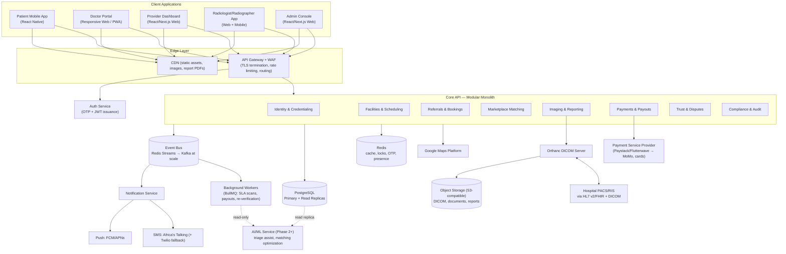

# System Architecture
## Radiology Uber (Working Title)

**Document version:** 0.1 (Draft for founding-team review)
**Date:** 2026-07-28
**Companion documents:** `docs/SRS.md` (requirements), `docs/PRD.md` (product/business), `docs/DATABASE_DESIGN.md` (schema)
**Scope note:** This is an architecture design document — technology choices, component boundaries, data flow, and scaling strategy, with reasoning for each decision. It contains diagrams, illustrative flow descriptions, and named technologies, but no application source code or implementation.

---

## 0. How to Read This Document

Every major decision below follows the same pattern: **what we chose, what we considered instead, and why** — because "explain every decision" only has value if the alternatives and trade-offs are visible, not just the conclusion. A consolidated decision log is in §17 for quick scanning; the prose in §3–§14 is where the actual reasoning lives.

The architecture is designed around one central discipline: **build a modular monolith with clean domain boundaries first, extract services only when a specific bottleneck proves it's needed.** This is stated up front because it explains why several sections below recommend the "boring," less distributed option even though this document also has to show a path to one million users — the two are not in tension. A well-indexed Postgres instance with read replicas and a caching layer comfortably serves far more than a million users of *this specific product* (see §2 for why this product's actual load profile is much lighter than its user count suggests), and a distributed microservices architecture adopted on day one would mostly buy this team operational risk, not headroom it actually needs yet.

---

## 1. Guiding Architectural Principles

1. **Boundaries in code before boundaries in infrastructure.** The backend is one deployable service at launch, but its internal module structure exactly mirrors the domain boundaries already established in `docs/DATABASE_DESIGN.md` (§2–§10 there). Extracting a module into its own service later should be a deployment change, not a rewrite.
2. **Events for anything that cascades across domains.** SRS §7.2 already flagged this: booking-confirmed triggers a notification, images-acquired triggers matching, report-signed triggers two more notifications. An event bus decouples these so no module needs direct knowledge of every downstream consequence of its own state changes.
3. **The database stays lean; large binary data never touches Postgres.** DICOM images, credential documents, and report attachments live in object storage/PACS, referenced by pointer — this is both a performance decision (Postgres excels at relational/transactional data, not multi-hundred-MB blobs) and a cost decision (object storage is dramatically cheaper per GB than database storage).
4. **Buy the undifferentiated heavy lifting; build the differentiator.** DICOM handling, identity/OTP infrastructure, payment rails, and mapping are solved problems elsewhere — money and engineering time go into the matching/marketplace logic that's actually the business, not into reimplementing a standards-heavy protocol or a payment gateway.
5. **Every design choice must survive the "does this scale to 1M *registered* users" question honestly** — which starts, in §2, with being precise about what that phrase actually implies for *this* product's traffic pattern, rather than borrowing assumptions from a fundamentally different product like ride-hailing.
6. **Clinical safety trumps architectural elegance.** Anywhere a trade-off pits "cleaner design" against "slower but safer" for the imaging/report/critical-finding path, the safer option wins, no exceptions — this is the same principle SRS/PRD apply to product decisions, carried into infrastructure.

---

## 2. Capacity Planning: What "1 Million Users" Actually Means Here

This section exists because skipping it is how systems get architected for the wrong bottleneck. A ride-hailing app's "1 million users" implies something close to 1 million people who might request a ride *today* — imaging is not a daily-use product. Sizing this system as if it were Uber's actual traffic pattern would lead to over-building the wrong layer (e.g., a heavyweight real-time dispatch engine) while under-building the layer that actually matters (durable, correctly-indexed transactional storage and a good caching layer for search).

**Working assumptions** (stated explicitly so they can be revisited as real data comes in, per PRD §10's success-metrics discipline):

| Metric | Estimate | Reasoning |
|---|---|---|
| Registered users | 1,000,000 | The stated target. |
| Weekly active users | ~100,000–150,000 (10–15%) | Consistent with a consumer app where the underlying need (getting imaging done) is occasional, not daily — most registered users are dormant between visits. |
| Daily active users | ~30,000–50,000 (3–5% of registered) | People checking booking status, viewing a report, or a practitioner checking their worklist. |
| Peak concurrent sessions | ~2,000–5,000 | A small fraction of DAU is ever concurrently active; bursty around weekday business hours (bookings) and specific notification pushes (report-ready fan-out). |
| Bookings per active patient per year | ~1.5 | Imaging is infrequent relative to, say, ride-hailing or food delivery — most people get a scan a small number of times a year, not per day. |
| Resulting booking volume | ~1.5M bookings/year ≈ ~4,200/day, ~30/minute at typical peak | This is a workload well within the comfortable range of a single well-tuned Postgres primary — most consumer-scale Postgres deployments handle thousands of transactions *per second*, not per day. |
| Average study size (object storage) | ~50MB (X-ray) to ~500MB (MRI series), blended ~150MB | Drives object storage volume, not database load, since images never enter Postgres (§1 principle 3). |
| Resulting annual image storage growth | ~1.5M × ~150MB ≈ ~225TB/year | A cost and lifecycle-management problem (tiered storage, §7.4), not a scaling-difficulty problem — object storage is designed for this by default. |

**The one place this reasoning does *not* relax the design target is teleradiology matching latency** (§6 of SRS, FR-MATCH-03/04): even at modest total daily volume, an individual offer-to-accept round trip needs to resolve in minutes, not because of *throughput* pressure but because a radiologist waiting on an unanswered offer is exactly the kind of delay the whole product exists to eliminate. So: **low-to-moderate sustained throughput, real-time-latency requirements on specific paths** — a very different profile from "high sustained throughput everywhere," and the architecture below is shaped around that distinction rather than around a generic "scale to a million" slogan.

**What this means practically:** a single-region deployment, a modular monolith rather than 15 microservices, and a Postgres primary + read replicas rather than a sharded/distributed database are not under-engineering for this target — they are the correctly-sized solution, with clear, named upgrade paths (§16) for the specific dimensions (object storage volume, notification fan-out, search query load) that will actually grow fastest.

---

## 3. High-Level Architecture

**Why a "modular monolith" box rather than eight separate service boxes:** every module in the Core API above corresponds to a bounded context already defined at the data layer in `docs/DATABASE_DESIGN.md`. They are deployed together today (one process, one repo, shared connection pool) but each module only accesses its own tables directly and talks to other modules' data through internal service interfaces — the same discipline microservices would enforce over the network, enforced instead by code review and module boundaries. This gets nearly all of microservices' maintainability benefit (no module reaching into another's tables) without its operational cost (service discovery, distributed transactions, network failure handling) at a stage where that cost isn't yet justified by load (§2).

---

## 4. Frontend Architecture

### 4.1 Patient Mobile App
**Choice: React Native (single codebase, Android-first, iOS second).**
- **Why not native Android/iOS separately:** the founding team is small; maintaining two native codebases doubles feature velocity cost for a product whose differentiation is marketplace logic, not platform-specific UI sophistication. React Native gets both platforms from one codebase with near-native performance for a forms-and-lists-and-status-tracking app like this one (it is not a graphics-intensive app; the one graphics-heavy screen — DICOM viewing — is deliberately kept to the radiologist's web app, §4.4, not the patient app).
- **Why not a pure web/PWA for patients:** push notifications (critical for report-ready and reminder flows, FR-NOTIF-01) are meaningfully more reliable via native app push (FCM) than web push on the low/mid-tier Android devices this market runs on; native OTP/SMS-autofill integration is also smoother. A PWA remains a reasonable *fallback* entry point (e.g., a doctor's referral link opening in-browser for a patient without the app installed yet) but is not the primary patient experience.
- **Offline tolerance (SRS §7.3):** state-changing actions (booking, rating) queue locally (e.g., via a lightweight local store such as WatermelonDB or a simple SQLite-backed queue) and sync when connectivity returns, rather than failing hard on a dropped connection — a hard requirement given the stated 3G/intermittent-connectivity operating environment, not an optional nicety.
- **Server-state management:** a data-fetching/caching library (e.g., TanStack Query) rather than hand-rolled fetch logic, so retry, caching, and background refresh on flaky networks are handled by a well-tested library instead of ad hoc code.

### 4.2 Doctor Portal
**Choice: Responsive web app (PWA-capable), not a dedicated native app at MVP.**
- **Why:** the doctor persona's core job (create a referral in under a minute, get notified when a report is ready) doesn't require offline tolerance or camera/GPS-grade native integration the way the patient app does — a referral link a doctor opens from a desktop browser or a phone browser during a consultation covers the MVP need. A dedicated app is a plausible Phase 2 addition once referral volume justifies the investment; building it now would be effort spent ahead of evidence it's needed (SRS §1.5-style non-goal reasoning applied to engineering, not just product scope).

### 4.3 Provider Web Dashboard & Admin Console
**Choice: React + TypeScript, built with Next.js.**
- **Why Next.js specifically:** these are desktop-first, data-dense, form-heavy internal tools (calendar management, order queues, credentialing review, dispute handling) — exactly what a conventional React SPA framework is built for. Next.js is chosen over a bare React SPA for its built-in routing/data-fetching conventions and because it can serve either as a full SPA or with server-rendering where useful (e.g., a fast-loading initial dashboard shell), without needing a second framework decision later.
- **Why the same TypeScript stack as the patient app's backend contracts:** sharing TypeScript types for API request/response shapes between frontend and backend (via a shared types package in a monorepo) removes an entire class of integration bugs (frontend and backend silently disagreeing about a field's shape) — a meaningful win for a small team without a dedicated QA function yet.

### 4.4 Radiologist / Radiographer App
**Choice: Web app (primary, for the reporting/viewing workflow) + a lightweight React Native module (worklist, availability toggle, push notifications) reusing the patient app's mobile shell.**
- **Why web-first for the radiologist specifically:** reading a diagnostic image is genuinely better on a larger screen with a mouse than on a phone — the DICOM viewer (§11) is embedded in the web dashboard, not the mobile app. Radiographers, who mostly need worklist/shift-acceptance functionality rather than image review, are well served by the mobile app.
- **Viewer integration:** the web app embeds OHIF (open-source, DICOMweb-compatible viewer, §11) rather than building a custom viewer — consistent with SRS §7.4's explicit instruction not to build DICOM viewing from scratch.

### 4.5 Cross-cutting frontend decisions
- **Low-bandwidth-first, not an afterthought:** aggressive image/thumbnail compression for anything shown in a list (e.g., facility photos), code-splitting so a patient never downloads the radiologist-reporting bundle, and a genuinely tested "poor network" mode (not just "works on office Wi-Fi") — directly answering SRS §5.6/§2.3.
- **Localization scaffolding built in from day one** (even though only English ships at MVP), so adding Twi (PRD §6 Phase 2) is a translation-file exercise, not a re-architecture.

---

## 5. Backend Architecture

### 5.1 Language & framework
**Choice: TypeScript on Node.js, using NestJS as the application framework.**
- **Why TypeScript/Node over alternatives (Go, Python/Django, Java/Spring):** this system's backend workload is overwhelmingly I/O-bound (database queries, calls to payment/SMS/maps providers, waiting on webhook responses) rather than CPU-bound — exactly the profile Node's async I/O model handles well. The decisive factor for a founding team, though, is **type-sharing with the frontend** (§4.3) and **hiring/velocity pragmatism**: a small team working in one language end-to-end ships faster and has fewer integration defects than a team split across two ecosystems, and nothing in this product's requirements (no heavy numerical computation, no extreme per-request latency budget) demands Go's or Java's raw throughput advantage enough to offset that cost. The one place Node is a poor fit — heavy image/CPU-bound processing — is deliberately kept *out* of the API process (see §5.4, background workers, and §11, where DICOM processing lives in Orthanc, a purpose-built C++ server, not custom Node code).
- **Why NestJS over a bare Express app:** NestJS's module system is exactly the mechanism used to enforce the "modular monolith with real internal boundaries" principle from §1 — each domain module (Identity, Facilities, Bookings, Matching, Imaging, Payments, Trust, Compliance) is a NestJS module with its own controllers/services/repositories, importable and testable in isolation, and extractable into its own deployable later with comparatively low rework because the dependency-injection boundaries already exist.

### 5.2 API style
**Choice: REST (resource-oriented, versioned `/v1/...`), not GraphQL.**
- **Why not GraphQL:** GraphQL earns its complexity when client teams have very different, unpredictable data-shape needs from a shared graph, or when over-/under-fetching is a measured, real problem. Here, each client (patient app, provider dashboard, radiologist app) has a small, well-known set of screens with predictable data needs — a small set of purpose-built REST endpoints per client (a lightweight BFF-flavored resource design, without introducing an actual separate BFF layer) is simpler to cache, rate-limit, log, and reason about operationally than a GraphQL layer, for no loss of capability at this scale. Revisit only if a specific, measured over-fetching problem emerges.

### 5.3 API Gateway
A managed or self-hosted API Gateway (e.g., Kong, or a cloud provider's native gateway) sits in front of the Core API for: TLS termination, coarse-grained rate limiting (protecting against both abuse and accidental client bugs, e.g., a retry loop), request routing/versioning, and centralizing the RBAC middleware that checks a request's JWT role claims against the route being called (§6) before it ever reaches application code — defense in depth alongside the module-level authorization checks inside the API.

### 5.4 Event bus & background processing
**Choice: Redis Streams at MVP, with a clean migration path to Kafka if/when event volume or consumer diversity grows (e.g., adding the AI/ML service, §13, as an independent consumer).**
- **Why Redis Streams first, not Kafka from day one:** Redis is already required in this architecture for caching, distributed locks, and OTP storage (§7.2) — using it as the event bus too avoids standing up and operating a second piece of stateful infrastructure (Kafka's operational overhead — brokers, partitioning, ZooKeeper/KRaft — is real cost with no payoff at the throughput levels in §2). Redis Streams supports consumer groups, which is the core capability actually needed here (multiple independent consumers of the same event: notification service, matching engine, audit logger). Kafka becomes worth its overhead once event volume, retention requirements, or the number of independent consuming services grows meaningfully past what a single Redis instance comfortably handles — a concrete, checkable trigger for migration, not a vague "eventually."
- **Background job execution:** BullMQ (Redis-backed job queues) runs scheduled and triggered background work: the SLA-breach scanner (re-routing report requests exceeding their turnaround target, FR-MATCH-04), payout batch generation (§7.6 of the DB design), credential-expiry checks (FR-ID-06), and notification delivery/retry (§8). Using the same Redis infrastructure for both the event bus and job queues is a deliberate simplification, not a missed distinction — they serve different purposes (pub/sub fan-out vs. reliable work queues) but neither needs dedicated infrastructure at this scale.

### 5.5 Concurrency-sensitive operations
Two specific operations are called out because "just write the obvious code" would introduce real bugs under concurrent load:
- **Slot booking (DB design §3.6):** two patients hitting "book" on the last available slot simultaneously must not both succeed. Implemented via an atomic conditional update (`UPDATE facility_service_slots SET slots_booked = slots_booked + 1 WHERE id = $1 AND slots_booked < capacity`, checking the affected-row count) inside the same database transaction that creates the `bookings` row — not a read-then-write check-then-act pattern, which races.
- **Match offer dispatch (DB design §6.2):** the matching engine must not offer the same report request to two radiologists in a way that both can accept it. A short-lived Redis distributed lock (or a `SELECT ... FOR UPDATE` on the `match_requests` row) guards the "check status is `open`, then create offers and flip to `matched`" sequence.

---

## 6. Authentication & Authorization

### 6.1 Patient authentication
**Choice: Phone number + SMS OTP as the primary login mechanism, no password.**
- **Why:** SRS §2.3 and FR-ID-02 both establish that SIM-based trust is the dominant, expected pattern in this market — asking a patient to create and remember a password adds friction with no corresponding security benefit for this user base, where phone-number ownership (verified per-login via OTP) is already a strong, familiar identity signal.
- **Mechanics:** OTP codes are short-lived (e.g., 5 minutes), single-use, stored in Redis with a TTL (never in Postgres — they're ephemeral by design), and rate-limited per phone number and per IP to prevent SMS-bombing abuse.

### 6.2 Practitioner & admin authentication
**Choice: Password + mandatory second factor (OTP via SMS or an authenticator app) for doctors, radiologists, radiographers, and all admin roles.**
- **Why stronger than patient auth:** these accounts can access other people's medical data, submit legally significant reports, or move money — a materially higher-value target than a patient account, warranting MFA as a hard requirement rather than an option (SRS §5.4).

### 6.3 Build vs. buy for the identity layer
**Choice: a thin, custom auth module (inside the Identity & Credentialing module, §5.1) issuing JWTs, rather than a full third-party identity platform (Auth0, AWS Cognito, Firebase Auth) as the system of record.**
- **What was considered:** Firebase Auth and Cognito both support phone/OTP login and would remove the need to build OTP issuance/verification logic in-house.
- **Why not adopted as the primary identity store anyway:** this platform's authorization model is unusually domain-specific — a JWT's claims need to reflect not just "who is this" but "is this practitioner currently *verified*," which is a fact that lives in `radiologist_profiles.verification_status`/`radiographer_profiles.verification_status` (DB design §2.6/§2.8) and can change at any moment (a license lapses, Ops suspends someone). A third-party identity platform's token would either need this business-specific claim synced into it (adding an integration layer anyway) or the application would need to re-check the database regardless (making the third-party token's convenience moot for exactly the check that matters most). Given that the actual OTP/SMS mechanics are a small, well-understood piece of code sitting behind an SMS gateway the platform needs anyway (§8), building this thin layer in-house is less overall complexity than integrating and working around a general-purpose identity platform's assumptions. This is flagged as a **debatable, revisit-if-wrong** call, not a certainty — if the in-house auth module becomes a maintenance burden, Firebase Auth (phone auth specifically) is a reasonable fallback for the login-verification step alone, while verification-status checks would remain custom regardless.
- **Critical design point on verification status:** a JWT's claims are treated as *identity*, not *authorization-at-this-instant*. Every request that touches a credential-gated action (accepting a match offer, submitting a report) re-checks current verification status — fast, via a Redis-cached read-through of the `verification_status` field, invalidated on any admin update — rather than trusting a claim baked into a token that might be hours old. This is the specific mechanism that makes instant suspension (FR-ID-06) actually instant, rather than "eventually, once the token expires."

### 6.4 Session mechanics
- **Access tokens:** short-lived (~15 minutes), JWT, carrying user ID and coarse role(s) only.
- **Refresh tokens:** longer-lived (~30 days), stored server-side (allowing revocation, e.g., on account suspension or device loss) rather than purely stateless, rotated on each use.
- **RBAC enforcement:** at the API Gateway (coarse: "is this role even allowed to call this route") and again inside each module's service layer (fine: "is this specific radiologist allowed to act on this specific match offer") — defense in depth, matching the DB design's own RBAC principle (`facility_staff.staff_role`, DB design §3.3).

---

## 7. Data Storage

This section extends `docs/DATABASE_DESIGN.md` with the infrastructure choices around it, rather than repeating the schema itself.

### 7.1 Primary datastore: PostgreSQL
**Choice: a single managed PostgreSQL cluster (e.g., AWS RDS/Aurora PostgreSQL, or an equivalent managed provider) with a primary and read replicas — not a sharded/distributed SQL system.**
- **Why:** §2's capacity analysis shows this product's actual transactional volume (thousands of bookings per day, not per second) is comfortably within a single well-tuned Postgres primary's capacity, especially once read-heavy traffic (search, dashboards, history views) is offloaded to replicas. Distributed SQL (Citus, CockroachDB, Spanner-likes) solves problems — cross-shard joins, write throughput beyond a single primary — that this system doesn't have yet, at the cost of real operational and query-planning complexity. Adopting one preemptively would be solving a problem that doesn't exist while creating one (distributed-system correctness) that does.
- **Read replica usage:** search/discovery queries (FR-DISC), provider dashboard order-queue views, and Ops marketplace-health dashboards (which are read-heavy and tolerate slight replication lag) are routed to replicas; anything in the booking/payment write path reads from the primary to avoid replication-lag-induced double-booking risk.
- **Large append-only tables** (`audit_logs`, `booking_status_history`, `notifications`, `payment_events` — all flagged in DB design) use native Postgres **table partitioning by time range** (e.g., monthly partitions) once volume warrants it, keeping index sizes and vacuum/maintenance costs bounded as history accumulates over years, without changing the logical table the application queries against.
- **Connection pooling:** PgBouncer (or equivalent) sits between the API layer and Postgres, since Node's per-request connection pattern at meaningful concurrency needs pooling to avoid exhausting Postgres's native connection limit.

### 7.2 Cache & ephemeral state: Redis
**Choice: a managed Redis cluster** (e.g., AWS ElastiCache or equivalent), serving multiple purposes rather than one dedicated service per purpose, because at this scale the operational simplicity of one well-understood piece of infrastructure outweighs the marginal isolation benefit of splitting it:
- Session/OTP storage (§6.1–6.2)
- Hot-path caching: search results, facility availability summaries, radiologist/radiographer `availability_status` (read extremely frequently by the matching engine, §5.5)
- Distributed locks (slot booking, match dispatch, §5.5)
- Event bus (Redis Streams, §5.4) and background job queues (BullMQ, §5.4)
- Rate limiting counters (API Gateway and OTP-request throttling)

### 7.3 Object storage
**Choice: S3-compatible object storage** (AWS S3, or a cost-optimized alternative like DigitalOcean Spaces/Backblaze B2, decided at infrastructure-provider selection time) for every binary artifact: DICOM images (via the PACS layer, §11), credential documents (§2.10 of the DB design), profile photos, and generated report PDFs.
- **Lifecycle policy:** newer studies/reports stay in standard (fast-retrieval) storage; older, rarely-accessed studies move to a cheaper cold-storage tier (e.g., S3 Glacier-class) after a defined age threshold, while still meeting the medico-legal retention period (SRS FR-IMG-09, pending the legal confirmation flagged as SRS open question 5) and remaining retrievable, if slowly, on demand (e.g., for a legal request or a returning patient's long-term history).
- **Delivery:** a CDN (§3 diagram) sits in front of the bucket for report/image delivery to reduce latency and egress cost, with signed, time-limited URLs so access still passes through the platform's authorization checks rather than being publicly world-readable.

### 7.4 Backups & disaster recovery
Automated daily Postgres snapshots plus point-in-time recovery (standard managed-Postgres capability); object storage versioning/immutability policies on the buckets holding reports and credential documents specifically, so a report can never be silently overwritten at the storage layer either — reinforcing the same immutability guarantee the database trigger enforces (DB design §5.2), at a different layer, on purpose (defense in depth for the single highest-liability data type in the system).

---

## 8. Notifications

**Why this component gets dedicated architectural attention (beyond "call an SMS API"):** SRS FR-NOTIF-01/03 requires push-with-SMS-fallback delivery, and the critical-finding escalation path (FR-IMG-08) is arguably the single highest-stakes notification in the whole product — a delayed or lost critical-finding alert is a patient-safety incident, not a missed marketing message (PRD risk R3). The notification service is therefore built as a distinct internal module with its own delivery-tracking table (`notifications`, DB design §10), not as scattered `sendSms()` calls sprinkled through other modules.

### 8.1 Channels
- **Push:** Firebase Cloud Messaging (FCM) for Android (the dominant platform in this market) and iOS (FCM can relay to APNs, avoiding a second integration for the smaller iOS user base).
- **SMS:** **Africa's Talking** as the primary provider, chosen specifically for its strong Ghana/West Africa delivery network and pricing, with **Twilio configured as a secondary/fallback provider** behind a thin internal abstraction — so an outage or delivery-quality issue with one provider doesn't take down SMS delivery platform-wide, and switching primary providers later is a config change, not a rewrite.

### 8.2 Delivery logic
The notification service consumes events off the event bus (§5.4) — `booking.confirmed`, `booking.reminder_due`, `report.ready`, `report.critical_finding`, `payment.receipt`, etc. — renders the appropriate template, and applies channel logic:
- **Standard notifications:** push first; if no delivery confirmation within a short window (or the user has no registered push token, common for lower-end devices/uninstalled scenarios), fall back to SMS.
- **Critical-finding notifications (FR-NOTIF-03):** bypass the standard fallback-after-timeout pattern entirely — **push and SMS are sent simultaneously**, on a separate high-priority queue, specifically because "wait and see if push worked before trying SMS" is an unacceptable delay for this one category. This is called out as a deliberate, hard-coded exception to the otherwise-uniform notification pipeline, not an oversight in the abstraction.
- Every send attempt and outcome is recorded in the `notifications` table (delivery-tracking, support debugging, and — combined with `payment_events`-style raw logging — the audit trail a "the app never told me" support dispute needs to be resolved with actual evidence rather than a guess.

---

## 9. Payments

### 9.1 Payment Service Provider
**Choice: a PSP aggregator (Paystack or Flutterwave — both have strong Ghana coverage) as the integration point, rather than integrating directly with each mobile network operator's MoMo API (MTN, Vodafone/Telecel, AirtelTigo) separately.**
- **Why:** direct-to-telco integration means building and maintaining three (or more) separate integrations, each with its own auth model, settlement process, and failure modes — a meaningful ongoing engineering cost for a small team. A PSP aggregator abstracts mobile money across operators *and* card payments behind one API and one webhook contract, at the cost of a small additional fee margin — a reasonable trade for a startup, revisited only if transaction volume grows large enough that direct integration's cost savings clearly outweigh the aggregator fee (a concrete, measurable future decision point, not a permanent choice).
- **PCI scope:** the platform never receives or stores raw card numbers — checkout uses the PSP's hosted/tokenized flow (redirect or embedded SDK), keeping the platform's PCI-DSS obligation at the lowest self-assessment tier (SAQ-A) rather than taking on cardholder-data-environment obligations that would otherwise apply.

### 9.2 The "hold funds until completion" requirement, concretely
SRS FR-PAY-03 requires the facility not be paid until the appointment is completed. Architecturally, this is implemented as **capture-now, payout-later**, not as a long escrow hold on the patient's payment:
- The patient's payment is **captured immediately** on booking confirmation (via the PSP) — this gives the platform certainty that funds actually exist and avoids the fragility of relying on a payment authorization surviving days until an appointment happens (authorizations can expire, and many MoMo flows don't support long holds cleanly).
- What's actually *held* is the **payout to the facility** — the `payouts`/`payout_line_items` batching mechanism (DB design §7.4/§7.5) only includes a booking's revenue once that booking reaches `completed` status, and refunds (§FR-PAY-07, DB design §7.3) are issued from the already-captured payment if a booking is cancelled or fails before completion. This distinction matters enough to state explicitly here because "hold funds" is easy to misread as "delay the charge," which is not what's architecturally implemented and not what the underlying PSP capabilities cleanly support in this market.

### 9.3 Webhook handling & reconciliation
- Webhooks are signature-verified against the PSP's signing secret before being trusted (SRS §8 checklist item), and processed idempotently (keyed on the PSP's transaction reference, DB design §7.1's `provider_reference` uniqueness) so a redelivered webhook (which all major PSPs do on retry) never double-processes a payment.
- A scheduled reconciliation job compares the PSP's settlement reports against the internal `payments`/`payouts` ledger on a regular cadence, flagging discrepancies for the Finance admin (PRD persona, SRS §2.2) rather than assuming the webhook stream alone is ever perfectly complete — webhooks can be missed; reconciliation is the backstop.

---

## 10. Maps

**Choice: Google Maps Platform (Geocoding, Places, Distance Matrix APIs), with Mapbox flagged as a cost-optimization revisit once volume justifies the switching cost.**
- **Why Google over Mapbox/OpenStreetMap-based options at MVP:** address and place data quality in Ghana specifically is the deciding factor — a patient searching for the nearest imaging center needs geocoding and place data that actually resolves Ghanaian addresses reliably, and Google's coverage is generally the strongest available option in this specific geography today, even at a higher per-call cost than alternatives. Given §2's actual query volume (search/geocoding calls scale with active users doing occasional searches, not with total registered users), the cost difference at MVP scale is small in absolute terms — worth paying for reliability now, worth re-evaluating once volume is large enough that the per-call cost gap becomes a real budget line item.
- **Usage boundaries:** geocoding runs primarily at facility-onboarding time (an address is geocoded once, cached, and rarely changes) and at patient search time (current location → nearby facilities); results are cached aggressively (facility coordinates barely ever change) specifically to control per-call cost, since geocoding a static address on every search would be pure waste.
- **Proximity search implementation:** combined with **PostGIS** (a Postgres extension, flagged as a recommended addition in DB design §3.2) — facility coordinates are indexed with a `GIST` index enabling efficient "nearest facilities to this point" queries directly in Postgres, with the Maps Platform providing geocoding/reverse-geocoding and display (map tiles, distance/ETA text), not the proximity-ranking computation itself. This keeps the core search query fast and free of an external API call on every search request.

---

## 11. PACS (Picture Archiving and Communication System)

**Choice: self-hosted Orthanc (open-source, DICOM-standard-compliant PACS server) as the platform's own PACS, rather than building DICOM storage/retrieval from scratch or committing early to a commercial cloud-PACS vendor.**
- **Why not build custom DICOM handling:** reiterating SRS §7.4's explicit reasoning because it's an architecturally load-bearing decision — DICOM is a decades-old, deeply specified protocol (transfer syntaxes, C-STORE/C-FIND/C-MOVE, WADO-RS) whose correctness has essentially zero product-differentiation value; every hour spent reimplementing it is an hour not spent on the matching engine that's the actual business. Orthanc is mature, widely deployed in production radiology settings, and has an S3 storage plugin — meaning it can use the object storage layer already in this architecture (§7.3) as its backing store rather than needing separate infrastructure.
- **Why not a commercial cloud-PACS vendor at MVP instead of self-hosting Orthanc:** commercial cloud-PACS offerings exist and are a legitimate later option, but typically come with per-study or per-GB pricing and contractual terms that are hard to evaluate favorably before the platform has real study volume to negotiate against — self-hosting Orthanc (which is free, open-source software; the cost is the compute/storage it runs on, already budgeted) keeps optionality open and cost predictable at MVP scale, without foreclosing a later move to a commercial vendor if operational burden or specific enterprise features (e.g., a hospital partner's compliance team insisting on a named vendor) make that the better call for a *specific* institutional partner (§12).
- **Ingestion paths:**
  1. **Modern facility with an existing PACS/modality supporting DICOM networking:** a lightweight on-site DICOM forwarder (or direct C-STORE configuration) sends studies to our Orthanc instance over a secured connection (VPN/site-to-site tunnel, or TLS-wrapped DICOM).
  2. **Facility with a standalone, non-networked modality (a real, named operational risk — SRS §4.2):** a manual upload path — a small onboarding tool accepting a USB/CD DICOM export, or, as an explicitly-acknowledged last resort for the least-digitized centers, a photographed/scanned film — uploads via a secure HTTPS ingestion endpoint that pushes into Orthanc. This path is deliberately kept low-tech and unglamorous because it's solving a real physical-world onboarding constraint, not a software problem that a cleverer API would fix.
- **Viewing:** the radiologist web app (§4.4) embeds **OHIF Viewer** (open-source, DICOMweb/WADO-RS-compatible), pointed at Orthanc — again, an integrated existing component rather than a custom-built viewer, per SRS §7.4.

---

## 12. RIS (Radiology Information System) Integration

This system plays **two different roles** depending on the partner, matching the persona distinction in PRD §3 between Nana (independent center owner, Persona 3) and Mr. Owusu (hospital radiology admin, Persona 6):

- **For independent imaging centers without an existing RIS:** the platform's own Facilities/Scheduling and Bookings modules (§5, DB design §3–§4) **are** their RIS — order/schedule management, patient demographics tied to a study, and report association all happen natively inside this platform. No integration is needed because there's no incumbent system to integrate with.
- **For hospitals with an existing RIS/PACS/EMR (SRS §7.5):** the platform integrates *alongside* the existing system rather than asking the hospital to replace it — a materially easier institutional sales motion (PRD §8, persona job-to-be-done: "without forcing my team onto a whole new system"). Integration uses:
  - **HL7 v2** messaging (ORM for orders, ORU for results) as the dominant real-world hospital interoperability standard, or **FHIR** where the hospital's system supports it, via an **interface engine** (e.g., Mirth Connect/NextGen Connect, open-source) acting as a translation broker between the hospital's HL7 feed and this platform's internal API/event model.
  - **Why an interface engine rather than a bespoke point-to-point integration per hospital:** each hospital's RIS/EMR vendor has its own dialect of HL7 message construction; a general-purpose interface engine is built specifically to absorb that variability through configurable channels rather than custom code per hospital partner — the standard, proven pattern in healthcare integration work, not a novel choice.
  - This integration is explicitly a **Phase 2 capability** (SRS §9/PRD §6) — MVP hospital partners, if any, participate primarily through the same booking/overflow-capacity mechanisms as independent centers, with deep RIS integration built once a specific, committed hospital partnership justifies the interface-engine investment.

---

## 13. AI Integration

**Scope discipline stated first because it's the most consequential decision in this section:** per SRS §1.5, this platform is explicitly **not** an AI-diagnosis/CAD company in this phase. Every AI/ML component below is either an operational-efficiency layer with a human always in the loop, or entirely outside the clinical path altogether. This isn't caution for its own sake — a missed or wrong AI-influenced finding is the single scariest failure mode in the whole system (PRD risk R3), and AI-in-the-diagnostic-path also very plausibly changes the regulatory posture of the whole product (medical device classification, SRS §10 open questions) in ways that need dedicated legal review before any commitment, not an engineering decision made unilaterally.

### 13.1 Architectural placement (applies to every AI use case below)
Any AI/ML service is:
- **A separate, optional service**, consuming data via the event bus or a read replica (§3 diagram) — never embedded inline in the critical booking/payment/reporting request path, so an AI service outage or slowdown can never block a booking or a report submission.
- **Read-only with respect to clinical tables.** An ML service can flag, suggest, or rank; it never writes to `reports`, `studies`, or anything else that carries clinical or financial weight.
- **Additive, with a human decision always downstream** — a suggestion a radiologist or an Ops admin can see and act on, never an autonomous action.

### 13.2 Near-term, lower-risk AI/ML applications (reasonable well before any diagnostic-AI conversation)
- **Matching-algorithm optimization (Phase 2):** once enough historical `match_offers` data exists (DB design §6.2 was explicitly built to log every offer/accept/decline for this reason), a learned ranking model can improve *which* radiologist gets offered a case first (e.g., based on historical accept-rate and turnaround for similar cases) — this is a ranking/ordering optimization over the existing human-accept-or-decline flow, not a diagnostic function, and carries comparatively low regulatory risk.
- **Demand forecasting:** predicting booking volume by region/modality to help Ops prioritize facility partnership efforts (PRD §1 G3) — a business-analytics application with no patient-facing clinical exposure at all.
- **Payment fraud/anomaly detection:** standard applied ML on the payments domain, well outside clinical scope.
- **Patient support chatbot/FAQ triage:** reduces cheap, repetitive support-ticket load (e.g., "how do I reschedule") without touching diagnosis.

### 13.3 Longer-term, higher-scrutiny application (Phase 3, gated)
- **Worklist triage/prioritization for radiologists:** an assistive model flagging studies that are statistically more likely to contain an urgent finding (e.g., using an established, ideally pre-validated triage model architecture rather than one built in-house from scratch) so a radiologist's queue is ordered by likely urgency rather than pure first-in-first-out. This is explicitly framed as **queue ordering, not diagnosis** — the radiologist still reads and reports on every study; the model only changes *sequence*, never *outcome*. Even so, this is flagged as requiring dedicated regulatory and medical-advisory sign-off before any production use (mirroring SRS §10's open-question treatment of teleradiology legality) — it is not something engineering should ship unilaterally once "the model works," precisely because "the model works" and "this is legally and clinically appropriate to deploy" are different questions answered by different people.

---

## 14. Observability, CI/CD & Infrastructure

Kept intentionally brief here since SRS §5.8 already establishes the requirement; this is the concrete implementation of that requirement.

- **Logging:** structured (JSON) application logs shipped to a centralized aggregator (e.g., Grafana Loki or a managed equivalent).
- **Metrics:** Prometheus + Grafana (or a managed alternative), with dashboards built around the **business** metrics from PRD §10 (North Star metric, SLA adherence, unmet-demand rate) as first-class panels alongside standard infra metrics (CPU, memory, queue depth) — a dashboard that only shows infra health and misses "is the marketplace actually working" is a common startup blind spot this architecture deliberately avoids.
- **Tracing:** OpenTelemetry, valuable once event-driven cross-module flows (§5.4) need debugging — a booking's full lifecycle across the event bus is otherwise hard to reconstruct from logs alone.
- **Deployment platform:** **containerized services on AWS ECS/Fargate (or equivalent managed container platform), not a self-managed Kubernetes cluster, at MVP.** Kubernetes' operational sophistication (and the platform-engineering headcount it typically demands) isn't justified yet for a small number of deployables at this scale (§2) — a managed container platform gets equivalent horizontal scaling and rolling-deployment capability with meaningfully less operational overhead for a small team. Revisit once the number of independently-deployed services and the sophistication of required orchestration (e.g., complex service-mesh needs) actually grows past what a managed container service comfortably handles.
- **Infrastructure as code:** Terraform, from day one — infrastructure that exists only as manual console clicks is a specific, well-known source of unrecoverable configuration drift and a real risk for a system handling regulated medical data.
- **CI/CD:** GitHub Actions running tests and building/pushing containers on every merge, with staged environments (dev → staging → production) and feature flags (e.g., Unleash, open-source) enabling the phased regional/feature rollout capability SRS §5.8 calls for (e.g., enabling teleradiology matching in a new region before enabling patient self-booking there).

---

## 15. Security Architecture Summary

This restates and locates, architecturally, the checklist already established in SRS §8 — included here so the architecture document is self-contained, not to re-derive it:

- **Edge:** WAF in front of the API Gateway; TLS everywhere (no plaintext transport of PII/PHI anywhere in the request path).
- **Network:** databases, Redis, and the PACS server sit in private subnets with no direct public internet exposure; only the API Gateway and load balancers are internet-facing.
- **Secrets:** a managed secrets store (AWS Secrets Manager, or HashiCorp Vault if self-hosting) — no credentials in code or environment files committed to a repository.
- **Encryption at rest:** KMS-managed encryption keys for the database, object storage buckets, and backups.
- **Authorization:** defense in depth as detailed in §6 — Gateway-level coarse RBAC, module-level fine-grained checks, and live (not token-cached) verification-status checks for credential-gated actions.
- **Audit:** every access to a report/study is written to `audit_logs` (DB design §9.2) — this is an architectural, not optional, side effect of the read path for clinical data, implemented as middleware/interceptor logic in the Imaging & Reporting module rather than something each call site has to remember to do.

---

## 16. Scalability Plan: From MVP to 1M+ Users

Restating §2's core point in forward-looking form: this architecture is not "sized exactly for 1 million users and no more" — it has clear, named headroom levers for the dimensions that will actually grow, without requiring a redesign:

| Dimension | MVP starting point | Lever when it grows | Trigger to act |
|---|---|---|---|
| **API compute** | A handful of container instances behind a load balancer | Horizontal auto-scaling (add instances) — the API is stateless by design (sessions/OTP live in Redis, not in-process), so this is a pure scale-out, no architecture change | CPU/latency thresholds on the container platform |
| **Database reads** | Primary + 1 read replica | Add more read replicas; route more query types to them | Replica lag or primary CPU consistently high on read-heavy endpoints |
| **Database writes** | Single primary | Vertical scale-up first (bigger instance) — this alone covers a large multiple of the §2 estimate; true write-sharding (Citus etc.) only if write volume grows an order of magnitude beyond the modeled booking rate | Sustained write-side CPU/IO saturation on the primary, not merely approaching it |
| **Large append-only tables** | Single table | Time-range partitioning (already planned in §7.1, not a future surprise) | Table size starting to noticeably slow index maintenance/vacuum |
| **Event bus** | Redis Streams | Migrate to Kafka | Consumer count or retention needs outgrow a single Redis instance's comfortable capacity |
| **Object storage** | Standard tier | Lifecycle policies to cold storage (already planned, §7.3) | Age-based, automatic — not a scale trigger at all, a standing policy |
| **Notification fan-out** | Single notification service instance/queue | Scale worker count consuming the queue (BullMQ workers are horizontally scalable by design) | Queue depth growing faster than it drains |
| **Search/geo query load** | PostGIS on the read replica | Dedicated search index (e.g., OpenSearch) if query complexity (not just volume) outgrows what PostGIS comfortably expresses | Search latency degrading despite replica scaling, or a genuine need for search features PostGIS doesn't do well (fuzzy text ranking, faceting) |
| **Module extraction** | One deployable (modular monolith) | Extract a specific module (most likely candidate: Imaging & Reporting, given its distinct scaling profile — large payloads, PACS dependency — versus the rest of the API) into its own service | A specific module's resource needs or deployment cadence genuinely diverge from the rest of the monolith's — not extracted preemptively "just in case" |

The consistent pattern: **every scaling lever has a concrete, observable trigger**, not a calendar date or a vague sense that "we're getting big now." This is the same discipline PRD §10 applies to product metrics, applied here to infrastructure — don't add complexity ahead of the evidence that it's needed, but know exactly what to reach for the moment the evidence appears.

---

## 17. Architecture Decision Log (Summary)

A scannable index of every major decision made above, for quick reference.

| # | Decision | Chosen | Alternatives considered | Section |
|---|---|---|---|---|
| 1 | Overall backend structure | Modular monolith, domain-aligned modules | Microservices from day one | §1, §3 |
| 2 | Patient/consumer client | React Native | Native iOS+Android, PWA-only | §4.1 |
| 3 | Doctor client | Responsive web/PWA | Dedicated native app | §4.2 |
| 4 | Provider/Admin client | React + Next.js | Bare React SPA, server-rendered MVC | §4.3 |
| 5 | Radiologist client | Web (viewer) + shared mobile shell (worklist) | Single unified mobile-only app | §4.4 |
| 6 | Backend language/framework | TypeScript/Node + NestJS | Go, Python/Django, Java/Spring | §5.1 |
| 7 | API style | REST, versioned | GraphQL | §5.2 |
| 8 | Event bus (MVP) | Redis Streams | Kafka/RabbitMQ from day one | §5.4 |
| 9 | Background jobs | BullMQ on Redis | A separate dedicated job-queue system | §5.4 |
| 10 | Patient auth | Phone + SMS OTP, no password | Password-based | §6.1 |
| 11 | Practitioner/admin auth | Password + mandatory MFA | Password-only | §6.2 |
| 12 | Identity platform | Thin custom auth module | Auth0/Cognito/Firebase Auth as system of record | §6.3 |
| 13 | Verification-status checks | Live, Redis-cached DB read on every gated action | Baked into long-lived JWT claims | §6.3 |
| 14 | Primary database | PostgreSQL, single cluster + replicas | Sharded/distributed SQL (Citus, CockroachDB) | §7.1 |
| 15 | Cache/ephemeral store | Redis (multi-purpose) | Separate dedicated systems per purpose | §7.2 |
| 16 | Binary/image storage | S3-compatible object storage, never in Postgres | Storing blobs in the database | §7.3 |
| 17 | SMS provider | Africa's Talking primary, Twilio fallback | Single-provider integration | §8.1 |
| 18 | Push notifications | FCM (covers Android + relays to APNs) | Separate FCM/APNs integrations, OneSignal | §8.1 |
| 19 | Critical-finding alerts | Simultaneous push+SMS, dedicated high-priority queue | Standard fallback-after-timeout pipeline | §8.2 |
| 20 | Payments integration | PSP aggregator (Paystack/Flutterwave) | Direct per-telco MoMo integration | §9.1 |
| 21 | "Hold funds" implementation | Capture now, delay facility *payout* | Long-hold payment authorization/escrow | §9.2 |
| 22 | Maps provider | Google Maps Platform | Mapbox, OpenStreetMap-based stack | §10 |
| 23 | Proximity search | PostGIS in Postgres | External geo-search service | §10 |
| 24 | PACS | Self-hosted Orthanc + object storage | Build custom DICOM handling; commercial cloud-PACS vendor | §11 |
| 25 | DICOM viewer | OHIF (embedded) | Build a custom viewer | §11 |
| 26 | Hospital RIS integration | HL7/FHIR via an interface engine (Mirth Connect-style) | Bespoke point-to-point integration per hospital | §12 |
| 27 | AI/ML scope | Assistive, read-only, human-in-the-loop; no diagnostic AI in this phase | Diagnostic/CAD AI as a core feature | §13 |
| 28 | Container orchestration | Managed containers (ECS/Fargate-class) | Self-managed Kubernetes | §14 |
| 29 | Infra provisioning | Terraform (IaC) from day one | Manual console configuration | §14 |

---

## 18. Approval

Requires sign-off from Founder/CEO, Head of Engineering, and Medical/Regulatory Advisor — the same gating group as `docs/SRS.md` and `docs/PRD.md`, since several decisions here (PACS/RIS approach, AI scope, payment "hold funds" mechanics) directly depend on the regulatory and business decisions those documents flag as still open.

| Reviewer | Role | Status |
|---|---|---|
| — | Founder/CEO | Pending |
| — | Head of Engineering | Pending |
| — | Medical/Regulatory Advisor | Pending |
