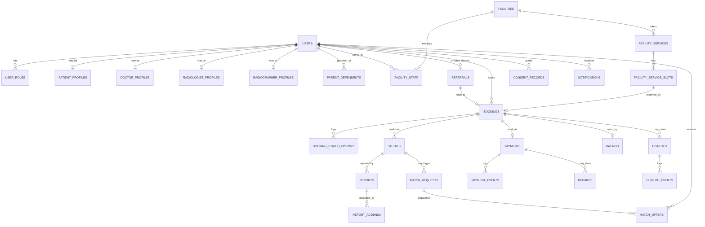

# Database Design
## Radiology Uber (Working Title) — PostgreSQL Schema

**Document version:** 0.1 (Draft for founding-team review)
**Date:** 2026-07-28
**Companion documents:** `docs/SRS.md` (functional requirements), `docs/PRD.md` (product/business context)
**Scope note:** This is a schema design artifact (DDL + rationale) only. No application/backend code, ORM models, or API contracts are included — those are downstream implementation work once this schema is approved.

---

## 0. Design Principles & Conventions

Stated up front because every table below follows these choices consistently, and reviewers should be able to disagree with a principle once rather than re-litigate it per table.

1. **Surrogate primary keys, UUID by default.** Every table uses a `UUID PRIMARY KEY DEFAULT gen_random_uuid()` unless stated otherwise. Reasons specific to this domain: (a) patient-facing identifiers (booking references, report IDs) must not be sequentially enumerable — a guessable integer ID on a medical-report endpoint is a real privacy bug, not a theoretical one; (b) it allows client apps to generate IDs offline and sync later, which matters given the offline-tolerance requirement in SRS §7.3. The one deliberate exception is `audit_logs`, which uses `BIGSERIAL` — see §9.2 for why.
2. **`TIMESTAMPTZ` everywhere**, never bare `TIMESTAMP` — Ghana is single-timezone today, but practitioners, cloud infra, and future multi-country expansion are not, and getting this wrong is a rewrite, not a config change.
3. **Money as `NUMERIC(10,2)` (or `NUMERIC(12,2)` for aggregated payout totals), never `FLOAT`/`REAL`.** Floating point currency bugs are a classic, entirely avoidable financial-integrity failure.
4. **Explicit `CHECK` constraints over trusting the application layer** wherever a rule is cheap to express in SQL (score ranges, non-negative prices, "exactly one of these two columns is set"). The application should never be the *only* thing standing between bad data and the database, especially for financial and clinical fields.
5. **Reference/lookup tables over `ENUM` types where the value set will plausibly grow** (e.g., `modalities`) — adding a row is a migration-free `INSERT`; adding an enum value is a schema migration. True closed, stable state machines (booking status, payment status) use Postgres `ENUM` types, since those value sets are structural, not data.
6. **No hard deletes on clinical or financial records.** `users`, `bookings`, `studies`, `reports`, `payments` and related tables are never `DELETE`d by the application — only status-transitioned (`account_status = 'deactivated'`, `booking.status = 'cancelled'`, etc.). This is a retention/medico-legal requirement (SRS FR-IMG-09), not a stylistic preference, so foreign keys from historical/audit tables into these tables use `ON DELETE RESTRICT` by default rather than `CASCADE`, to make an accidental delete fail loudly instead of silently destroying medical history.
7. **`ON DELETE CASCADE` is reserved for genuinely dependent child rows** whose only reason to exist is to describe their parent (e.g., `booking_status_history`, `dispute_events`, `match_offers`) — deleting the parent legitimately means deleting these; this is called out per-table below, not assumed globally.
8. **A person is a `users` row; roles are additive, not exclusive.** Dr. Mensah can be both a doctor and, separately, a patient booking for his own family — so role-specific data lives in per-role profile tables keyed 1:1 to `users`, joined through a `user_roles` table, rather than a single `role` column on `users`.
9. **Extensions required:**
   ```sql
   CREATE EXTENSION IF NOT EXISTS pgcrypto;  -- gen_random_uuid()
   CREATE EXTENSION IF NOT EXISTS citext;    -- case-insensitive email storage
   ```
   PostGIS/`earthdistance` for true geo-proximity search is called out as a recommended addition in §2.1 rather than assumed, since it's an infra decision (managed Postgres extension availability) outside this document's scope.
10. **A shared `updated_at` trigger convention.** Rather than repeat trigger boilerplate per table, one function is defined once and attached to every table that has an `updated_at` column:
    ```sql
    CREATE OR REPLACE FUNCTION set_updated_at()
    RETURNS TRIGGER AS $$
    BEGIN
      NEW.updated_at = now();
      RETURN NEW;
    END;
    $$ LANGUAGE plpgsql;
    ```
    Each such table gets: `CREATE TRIGGER trg_<table>_updated_at BEFORE UPDATE ON <table> FOR EACH ROW EXECUTE FUNCTION set_updated_at();` — noted once here rather than repeated 20 times below.

---

## 1. Entity Relationship Overview

High-level view first; full field-level detail follows by domain in §2–§10. Lookup/join tables are omitted from the diagram for readability — see §2–§10 for those.



### Relationship summary (for quick reference)

| Relationship | Cardinality | Notes |
|---|---|---|
| User ↔ Roles | 1 : many | A user can hold multiple roles (patient + doctor, etc.) |
| User ↔ role-specific profile | 1 : 0..1 per role | `patient_profiles`, `doctor_profiles`, etc. — PK is the same UUID as `users.id` |
| Patient (guardian) ↔ Dependents | 1 : many | Family booking model (SRS §6) |
| Facility ↔ Staff (Users) | many : many | via `facility_staff` — a radiologist/radiographer can work at multiple facilities |
| Facility ↔ Services | 1 : many | A facility's bookable catalog |
| Facility Service ↔ Slots | 1 : many | Real-time calendar |
| Booking ↔ Slot | many : 1 | A slot has `capacity`; multiple bookings can fill one slot up to capacity |
| Booking ↔ Study | 1 : many | Normally 1; more if a re-scan is required |
| Study ↔ Report | 1 : many | Normally 1; more if the case is escalated for peer review (Phase 2) |
| Report ↔ Addenda | 1 : many | Append-only correction trail |
| Study ↔ Match Request | 1 : 0..many | Only created when teleradiology routing is needed |
| Match Request ↔ Match Offer | 1 : many | One offer row per candidate practitioner contacted |
| Booking ↔ Payment | 1 : 1 (active) | Multiple historical attempts allowed; only one "active" successful payment enforced by partial unique index |
| Booking ↔ Rating | 1 : 0..1 | One rating per completed booking |
| Booking ↔ Dispute | 1 : 0..many | A booking could generate more than one dispute over time (rare but possible) |

---

## 2. Domain: Identity, Roles & Credentialing

**Why this domain exists:** Every other domain depends on knowing *who* someone is and *what they're licensed/authorized to do* before anything clinical, financial, or scheduling-related happens. Because this platform mediates regulated medical work, identity here is inseparable from credential verification — a `radiologist_profiles` row existing is not the same as that radiologist being allowed to accept a case (SRS FR-ID-03/04).

### 2.1 `users`
The single base identity for every human on the platform, regardless of role. Kept intentionally thin — role-specific data lives in its own table — so that a doctor who is also a patient doesn't require two disconnected identities.

```sql
CREATE TABLE users (
    id                UUID PRIMARY KEY DEFAULT gen_random_uuid(),
    phone_number      TEXT NOT NULL,
    email             CITEXT,
    password_hash     TEXT,                          -- NULL for patients who are OTP-only (SRS FR-ID-02)
    full_name         TEXT NOT NULL,
    preferred_language TEXT NOT NULL DEFAULT 'en',
    account_status    TEXT NOT NULL DEFAULT 'active'
                      CHECK (account_status IN ('active','suspended','deactivated')),
    created_at        TIMESTAMPTZ NOT NULL DEFAULT now(),
    updated_at        TIMESTAMPTZ NOT NULL DEFAULT now()
);

CREATE UNIQUE INDEX ux_users_phone_number ON users (phone_number);
CREATE UNIQUE INDEX ux_users_email ON users (email) WHERE email IS NOT NULL;
CREATE TRIGGER trg_users_updated_at BEFORE UPDATE ON users
    FOR EACH ROW EXECUTE FUNCTION set_updated_at();
```
- **PK:** `id`.
- **Constraints:** `phone_number` unique and required (it's the trusted identity anchor per SRS §2.3 — SIM-based OTP is the dominant trust pattern in this market); `email` unique only when present (partial unique index, since many patients won't have one).
- **Indexes:** unique index on `phone_number` (also the natural lookup path for OTP login); partial unique index on `email`.

### 2.2 `user_roles`
Exists because a single `role` column on `users` cannot express "this person is both a doctor and a patient," which is a normal, expected case (SRS §2.2 persona: Dr. Mensah).

```sql
CREATE TYPE user_role AS ENUM (
    'patient','doctor','radiologist','radiographer',
    'center_admin','hospital_admin','platform_admin','finance_admin'
);

CREATE TABLE user_roles (
    id         UUID PRIMARY KEY DEFAULT gen_random_uuid(),
    user_id    UUID NOT NULL REFERENCES users(id) ON DELETE RESTRICT,
    role       user_role NOT NULL,
    created_at TIMESTAMPTZ NOT NULL DEFAULT now(),
    UNIQUE (user_id, role)
);

CREATE INDEX ix_user_roles_user_id ON user_roles (user_id);
```
- **FK:** `user_id → users(id)`, `RESTRICT` (a role grant is a compliance-relevant record; don't let it vanish silently).
- **Constraint:** `UNIQUE(user_id, role)` — a role can't be granted twice.
- **Enum is appropriate here** (rather than a lookup table) because this list is structural to the whole system's authorization model, not user-editable business data.

### 2.3 `patient_profiles`
Holds the clinical/demographic fields relevant only to a patient — kept off the base `users` table because a doctor-only or radiologist-only account has no use for date of birth or emergency contact in this system.

```sql
CREATE TABLE patient_profiles (
    user_id                 UUID PRIMARY KEY REFERENCES users(id) ON DELETE RESTRICT,
    date_of_birth           DATE NOT NULL,
    gender                  TEXT,
    emergency_contact_name  TEXT,
    emergency_contact_phone TEXT,
    created_at              TIMESTAMPTZ NOT NULL DEFAULT now()
);
```
- **PK/FK combined:** `user_id` is both — enforces the strict 1:1 relationship to `users` cleanly (a row here *is* the patient extension of that user, not a separate entity).

### 2.4 `patient_dependents`
Exists specifically to satisfy the family-booking requirement called out as an easy-to-under-design gap in SRS §6 — Ama books an ultrasound for her mother using her own account. A dependent is not a `users` row (no login, no phone/OTP identity) — it is data owned by the guardian's account.

```sql
CREATE TABLE patient_dependents (
    id             UUID PRIMARY KEY DEFAULT gen_random_uuid(),
    guardian_user_id UUID NOT NULL REFERENCES users(id) ON DELETE RESTRICT,
    full_name      TEXT NOT NULL,
    date_of_birth  DATE NOT NULL,
    gender         TEXT,
    relationship   TEXT NOT NULL,   -- e.g. 'child','parent','spouse','other'
    created_at     TIMESTAMPTZ NOT NULL DEFAULT now()
);

CREATE INDEX ix_patient_dependents_guardian ON patient_dependents (guardian_user_id);
```
- **FK:** `guardian_user_id → users(id)`, `RESTRICT`. (The application layer, not a DB constraint, enforces that the guardian holds the `patient` role — Postgres `CHECK` constraints can't cheaply query another table; this is a documented app-layer invariant, not left unstated.)

### 2.5 `doctor_profiles`
```sql
CREATE TYPE credential_status AS ENUM ('pending','verified','rejected','expired','suspended');

CREATE TABLE doctor_profiles (
    user_id                       UUID PRIMARY KEY REFERENCES users(id) ON DELETE RESTRICT,
    professional_registration_no TEXT NOT NULL UNIQUE,
    specialty                    TEXT,
    clinic_name                  TEXT,
    verification_status          credential_status NOT NULL DEFAULT 'pending',
    verified_at                  TIMESTAMPTZ,
    verified_by                  UUID REFERENCES users(id) ON DELETE RESTRICT,
    created_at                   TIMESTAMPTZ NOT NULL DEFAULT now()
);
```
- **Why a separate `verification_status` per profile type rather than one generic table:** doctors, radiologists, and radiographers are verified against *different* regulatory bodies (SRS §2.4) with different fields of record (a doctor's registration number is not an MDC radiologist license, even though both are MDC-issued) — collapsing them into one polymorphic table would obscure which regulator's number is which, a real risk in an audit.
- **Constraint:** `professional_registration_no` unique — one registration number cannot back two accounts.

### 2.6 `radiologist_profiles`
The scarce, differentiating supply-side resource (PRD §1 G4) — this table and its verification workflow are treated with the most operational care of any profile table.

```sql
CREATE TABLE radiologist_profiles (
    user_id              UUID PRIMARY KEY REFERENCES users(id) ON DELETE RESTRICT,
    mdc_license_no       TEXT NOT NULL UNIQUE,
    years_experience     SMALLINT CHECK (years_experience >= 0),
    verification_status  credential_status NOT NULL DEFAULT 'pending',
    verified_at          TIMESTAMPTZ,
    verified_by          UUID REFERENCES users(id) ON DELETE RESTRICT,
    license_expiry_date  DATE,
    availability_status  TEXT NOT NULL DEFAULT 'offline'
                         CHECK (availability_status IN ('online','busy','offline')),
    created_at           TIMESTAMPTZ NOT NULL DEFAULT now(),
    updated_at           TIMESTAMPTZ NOT NULL DEFAULT now()
);

CREATE INDEX ix_radiologist_profiles_availability
    ON radiologist_profiles (availability_status)
    WHERE verification_status = 'verified';

CREATE TRIGGER trg_radiologist_profiles_updated_at BEFORE UPDATE ON radiologist_profiles
    FOR EACH ROW EXECUTE FUNCTION set_updated_at();
```
- **Index rationale:** the matching engine's single most frequent query is "who is verified *and* currently online" (FR-MATCH-02/03) — a partial index scoped to verified rows makes that lookup cheap even as the unverified/pending backlog grows.
- **`license_expiry_date`** exists to support automated suspension on lapse (SRS FR-ID-06, Phase 2 automation, but the column belongs in the schema now rather than as a retrofit).

### 2.7 `radiologist_subspecialties`
A radiologist can declare multiple subspecialties (neuro, MSK, etc. — SRS FR-MATCH-02); a join-style table avoids an array column that's awkward to index/query against.

```sql
CREATE TABLE radiologist_subspecialties (
    radiologist_user_id UUID NOT NULL REFERENCES radiologist_profiles(user_id) ON DELETE CASCADE,
    subspecialty        TEXT NOT NULL,
    PRIMARY KEY (radiologist_user_id, subspecialty)
);
```
- **`ON DELETE CASCADE`** is correct here: a subspecialty tag has no independent meaning without its radiologist profile.

### 2.8 `radiographer_profiles`
```sql
CREATE TABLE radiographer_profiles (
    user_id              UUID PRIMARY KEY REFERENCES users(id) ON DELETE RESTRICT,
    ahpc_license_no      TEXT NOT NULL UNIQUE,
    verification_status  credential_status NOT NULL DEFAULT 'pending',
    verified_at          TIMESTAMPTZ,
    verified_by          UUID REFERENCES users(id) ON DELETE RESTRICT,
    license_expiry_date  DATE,
    availability_status  TEXT NOT NULL DEFAULT 'offline'
                         CHECK (availability_status IN ('online','busy','offline')),
    created_at           TIMESTAMPTZ NOT NULL DEFAULT now(),
    updated_at           TIMESTAMPTZ NOT NULL DEFAULT now()
);

CREATE TRIGGER trg_radiographer_profiles_updated_at BEFORE UPDATE ON radiographer_profiles
    FOR EACH ROW EXECUTE FUNCTION set_updated_at();
```

### 2.9 `radiographer_modalities`
Which equipment a radiographer is qualified/licensed to operate — needed so a shift-gig posting for a sonographer never gets offered to an X-ray-only technologist (FR-MATCH-05).

```sql
CREATE TABLE radiographer_modalities (
    radiographer_user_id UUID NOT NULL REFERENCES radiographer_profiles(user_id) ON DELETE CASCADE,
    modality_id          UUID NOT NULL REFERENCES modalities(id) ON DELETE RESTRICT,
    PRIMARY KEY (radiographer_user_id, modality_id)
);
```
- **Note:** references `modalities`, defined in §3.1 — this table is listed here for domain cohesion but physically depends on the facilities-domain lookup table.

### 2.10 `practitioner_credential_documents`
The actual verification workflow (SRS FR-ID-03/04): uploaded documents plus their review outcome, independent of the profile's summary `verification_status` so a full audit trail of *what was reviewed and by whom* survives even after the profile's status field is updated.

```sql
CREATE TABLE practitioner_credential_documents (
    id               UUID PRIMARY KEY DEFAULT gen_random_uuid(),
    user_id          UUID NOT NULL REFERENCES users(id) ON DELETE RESTRICT,
    document_type    TEXT NOT NULL,   -- 'license_certificate','national_id','proof_of_registration', ...
    file_url         TEXT NOT NULL,   -- pointer into object storage; the file itself is never stored in Postgres
    uploaded_at      TIMESTAMPTZ NOT NULL DEFAULT now(),
    review_status    credential_status NOT NULL DEFAULT 'pending',
    reviewed_by      UUID REFERENCES users(id) ON DELETE RESTRICT,
    reviewed_at      TIMESTAMPTZ,
    rejection_reason TEXT
);

CREATE INDEX ix_credential_documents_user ON practitioner_credential_documents (user_id);
CREATE INDEX ix_credential_documents_pending ON practitioner_credential_documents (review_status)
    WHERE review_status = 'pending';
```
- **Index rationale:** the Ops credentialing queue (FR-ADM-01) is a query for "everything pending," so a partial index on that exact predicate keeps the admin console fast regardless of total historical document volume.

### 2.11 `admin_profiles`
Deliberately minimal — internal Ops/Finance/Support staff don't need the regulatory rigor of clinical roles; fine-grained permission logic lives in the application layer, not as a sprawling permissions schema that isn't needed yet (per the "don't build for hypothetical requirements" principle).

```sql
CREATE TABLE admin_profiles (
    user_id     UUID PRIMARY KEY REFERENCES users(id) ON DELETE RESTRICT,
    department  TEXT NOT NULL CHECK (department IN ('ops','finance','support')),
    created_at  TIMESTAMPTZ NOT NULL DEFAULT now()
);
```

---

## 3. Domain: Facilities, Services & Scheduling

**Why this domain exists:** This is the supply-side inventory — what can be booked, where, at what price, and when. It has to model real operational messiness (a facility with two MRI machines where only one works today) because that's exactly the kind of detail that breaks a naively simple "facility has a calendar" model in production (SRS FR-BOOK-07).

### 3.1 `modalities`
A lookup table, not an enum, because new imaging service types (a new mammography sub-type, a new ultrasound protocol) are a business/catalog change, not a schema change.

```sql
CREATE TABLE modalities (
    id                       UUID PRIMARY KEY DEFAULT gen_random_uuid(),
    code                     TEXT NOT NULL UNIQUE,   -- 'XRAY','US','CT','MRI','MAMMO', ...
    display_name             TEXT NOT NULL,
    typical_duration_minutes SMALLINT NOT NULL CHECK (typical_duration_minutes > 0)
);
```

### 3.2 `facilities`
An imaging center or hospital — the two facility types share almost all fields, so one table with a type discriminator is simpler than two near-duplicate tables (SRS §2.1/§2.2 treats them as variants of one concept: a place with scanner capacity).

```sql
CREATE TYPE facility_type AS ENUM ('imaging_center','hospital');

CREATE TABLE facilities (
    id                      UUID PRIMARY KEY DEFAULT gen_random_uuid(),
    name                    TEXT NOT NULL,
    facility_type           facility_type NOT NULL,
    ghs_license_no          TEXT,
    address_line            TEXT NOT NULL,
    city                    TEXT NOT NULL,
    region                  TEXT NOT NULL,
    latitude                NUMERIC(9,6),
    longitude               NUMERIC(9,6),
    phone_number            TEXT NOT NULL,
    verification_status     credential_status NOT NULL DEFAULT 'pending',
    verified_at             TIMESTAMPTZ,
    verified_by             UUID REFERENCES users(id) ON DELETE RESTRICT,
    has_onsite_radiologist  BOOLEAN NOT NULL DEFAULT false,
    created_at              TIMESTAMPTZ NOT NULL DEFAULT now(),
    updated_at              TIMESTAMPTZ NOT NULL DEFAULT now()
);

CREATE INDEX ix_facilities_city_region ON facilities (city, region);
CREATE TRIGGER trg_facilities_updated_at BEFORE UPDATE ON facilities
    FOR EACH ROW EXECUTE FUNCTION set_updated_at();
```
- **`has_onsite_radiologist`** is the field the matching engine reads to decide whether a completed study needs to go to the teleradiology queue (FR-MATCH-01) — it's a facility-level flag, not inferred at query time, because it's a business fact the facility itself declares/updates, not something derivable purely from staffing rows.
- **`latitude`/`longitude`** as plain `NUMERIC` columns are sufficient for MVP display and coarse filtering; true proximity search (`ORDER BY distance`) at scale should use PostGIS `geography(Point)` with a `GIST` index — flagged here as a recommended upgrade, not built into the base schema, since it's an infrastructure/extension-availability decision for the Technical Design Doc, not a structural requirement of the data model itself.
- **Index on `(city, region)`** supports the common "search near me" filter path before/alongside true geo-distance sorting.

### 3.3 `facility_staff`
Models the many-to-many reality explicitly called out in SRS §6: a radiologist or radiographer works across *multiple* facilities on a gig basis, and a facility has multiple staff. This table is the join, carrying the role context that's specific to *that* facility relationship (e.g., front-desk at Facility A, radiographer at Facility B).

```sql
CREATE TABLE facility_staff (
    id               UUID PRIMARY KEY DEFAULT gen_random_uuid(),
    facility_id      UUID NOT NULL REFERENCES facilities(id) ON DELETE RESTRICT,
    user_id          UUID NOT NULL REFERENCES users(id) ON DELETE RESTRICT,
    staff_role       TEXT NOT NULL CHECK (staff_role IN
                     ('front_desk','center_admin','hospital_admin','radiographer','radiologist')),
    employment_type  TEXT NOT NULL CHECK (employment_type IN ('employee','gig')),
    is_active        BOOLEAN NOT NULL DEFAULT true,
    created_at       TIMESTAMPTZ NOT NULL DEFAULT now(),
    UNIQUE (facility_id, user_id, staff_role)
);

CREATE INDEX ix_facility_staff_facility ON facility_staff (facility_id) WHERE is_active;
CREATE INDEX ix_facility_staff_user ON facility_staff (user_id) WHERE is_active;
```
- **Fine-grained permission enforcement** (e.g., "front-desk can manage bookings but not payouts," SRS FR-ID-07) is deliberately *not* modeled as a separate permissions-matrix table here — `staff_role` is the authorization signal, and the mapping from role to allowed actions lives in application code/config. A full RBAC permissions schema is more machinery than the current requirement set justifies; add it if/when role-permission mappings need to be admin-configurable rather than code-defined.

### 3.4 `facility_equipment`
Exists specifically for the "one of two MRI machines is down" case (FR-BOOK-07) — without this table, a facility's capacity is a single opaque number per modality, which is exactly the kind of simplification that causes real double-booking incidents in production.

```sql
CREATE TABLE facility_equipment (
    id             UUID PRIMARY KEY DEFAULT gen_random_uuid(),
    facility_id    UUID NOT NULL REFERENCES facilities(id) ON DELETE RESTRICT,
    modality_id    UUID NOT NULL REFERENCES modalities(id) ON DELETE RESTRICT,
    label          TEXT NOT NULL,   -- e.g. "MRI Machine 1"
    is_operational BOOLEAN NOT NULL DEFAULT true,
    created_at     TIMESTAMPTZ NOT NULL DEFAULT now()
);

CREATE INDEX ix_facility_equipment_facility ON facility_equipment (facility_id);
```

### 3.5 `facility_services`
The bookable catalog line-item: a specific study, at a specific facility, at a specific price. Price and duration live *here*, not on `modalities`, because the same modality (e.g., ultrasound) is priced and timed differently per facility.

```sql
CREATE TABLE facility_services (
    id                            UUID PRIMARY KEY DEFAULT gen_random_uuid(),
    facility_id                   UUID NOT NULL REFERENCES facilities(id) ON DELETE RESTRICT,
    modality_id                   UUID NOT NULL REFERENCES modalities(id) ON DELETE RESTRICT,
    name                          TEXT NOT NULL,   -- e.g. "Abdominal Ultrasound"
    price_ghs                     NUMERIC(10,2) NOT NULL CHECK (price_ghs >= 0),
    duration_minutes              SMALLINT NOT NULL CHECK (duration_minutes > 0),
    pre_appointment_instructions  TEXT,
    is_active                     BOOLEAN NOT NULL DEFAULT true,
    created_at                    TIMESTAMPTZ NOT NULL DEFAULT now(),
    updated_at                    TIMESTAMPTZ NOT NULL DEFAULT now(),
    UNIQUE (facility_id, modality_id, name)
);

CREATE INDEX ix_facility_services_facility ON facility_services (facility_id) WHERE is_active;
CREATE TRIGGER trg_facility_services_updated_at BEFORE UPDATE ON facility_services
    FOR EACH ROW EXECUTE FUNCTION set_updated_at();
```
- **`price_ghs` is snapshotted onto the `bookings` row at booking time** (see §4.2) — this table holds the *current* listed price, which can change; historical bookings must never retroactively reprice.

### 3.6 `facility_service_slots`
The real-time calendar (FR-DISC-04) — the single most write/read-heavy table in the scheduling domain, since every search and every booking touches it.

```sql
CREATE TABLE facility_service_slots (
    id                    UUID PRIMARY KEY DEFAULT gen_random_uuid(),
    facility_service_id   UUID NOT NULL REFERENCES facility_services(id) ON DELETE RESTRICT,
    equipment_id          UUID REFERENCES facility_equipment(id) ON DELETE RESTRICT,
    start_time            TIMESTAMPTZ NOT NULL,
    end_time              TIMESTAMPTZ NOT NULL,
    capacity              SMALLINT NOT NULL DEFAULT 1 CHECK (capacity > 0),
    slots_booked          SMALLINT NOT NULL DEFAULT 0 CHECK (slots_booked >= 0 AND slots_booked <= capacity),
    is_blocked            BOOLEAN NOT NULL DEFAULT false,   -- manual block, e.g. maintenance
    created_at            TIMESTAMPTZ NOT NULL DEFAULT now(),
    updated_at            TIMESTAMPTZ NOT NULL DEFAULT now(),
    CHECK (end_time > start_time),
    UNIQUE (facility_service_id, equipment_id, start_time)
);

CREATE INDEX ix_slots_service_time ON facility_service_slots (facility_service_id, start_time);
CREATE INDEX ix_slots_bookable ON facility_service_slots (start_time)
    WHERE is_blocked = false;
CREATE TRIGGER trg_slots_updated_at BEFORE UPDATE ON facility_service_slots
    FOR EACH ROW EXECUTE FUNCTION set_updated_at();
```
- **`slots_booked <= capacity`** is enforced at the row level, but the actual increment-on-booking must happen inside the same transaction as the `bookings` insert (e.g., `SELECT ... FOR UPDATE` or an atomic `UPDATE ... WHERE slots_booked < capacity`) to prevent a race condition double-booking the last slot — this is an application-transaction concern the schema enables but cannot fully guarantee alone, called out explicitly so it isn't missed during implementation.
- **Composite index `(facility_service_id, start_time)`** is the calendar-view query's primary access path.

---

## 4. Domain: Referrals & Bookings

**Why this domain exists:** This is the transactional core of the marketplace — the thing that turns "a patient wants a scan" into a scheduled, tracked, stateful order that every other domain (imaging, payments, matching) hangs off of.

### 4.1 `referrals`
A doctor-initiated referral can exist *before* a booking (Dr. Mensah creates it, the patient completes booking later, possibly days after) — modeled as its own entity rather than a "draft booking," since a referral can expire or never convert (FR-BOOK-02, FR-DISC-05).

```sql
CREATE TABLE referrals (
    id                     UUID PRIMARY KEY DEFAULT gen_random_uuid(),
    referring_doctor_user_id UUID NOT NULL REFERENCES users(id) ON DELETE RESTRICT,
    patient_user_id        UUID REFERENCES users(id) ON DELETE RESTRICT,
    dependent_id           UUID REFERENCES patient_dependents(id) ON DELETE RESTRICT,
    modality_id            UUID NOT NULL REFERENCES modalities(id) ON DELETE RESTRICT,
    clinical_notes         TEXT,
    is_urgent              BOOLEAN NOT NULL DEFAULT false,
    preferred_facility_id  UUID REFERENCES facilities(id) ON DELETE RESTRICT,
    status                 TEXT NOT NULL DEFAULT 'pending'
                           CHECK (status IN ('pending','booked','expired','cancelled')),
    created_at             TIMESTAMPTZ NOT NULL DEFAULT now(),
    expires_at             TIMESTAMPTZ,
    CHECK (num_nonnulls(patient_user_id, dependent_id) = 1)
);

CREATE INDEX ix_referrals_doctor ON referrals (referring_doctor_user_id);
CREATE INDEX ix_referrals_patient ON referrals (patient_user_id) WHERE patient_user_id IS NOT NULL;
CREATE INDEX ix_referrals_status_urgent ON referrals (status, is_urgent);
```
- **`CHECK (num_nonnulls(patient_user_id, dependent_id) = 1)`** enforces the polymorphic-beneficiary pattern used throughout this schema: the subject of a referral/booking is *either* a registered patient user *or* a dependent record, never both, never neither.

### 4.2 `bookings`
The central order entity. Every downstream domain (studies, payments, ratings, disputes) hangs a foreign key off this table.

```sql
CREATE TYPE booking_status AS ENUM (
    'requested','confirmed','checked_in','in_progress',
    'images_acquired','report_pending','report_ready',
    'completed','cancelled','no_show'
);

CREATE TABLE bookings (
    id                     UUID PRIMARY KEY DEFAULT gen_random_uuid(),
    booking_reference      TEXT NOT NULL UNIQUE,   -- human-friendly code shown to patient/front-desk
    booked_by_user_id      UUID NOT NULL REFERENCES users(id) ON DELETE RESTRICT,
    beneficiary_dependent_id UUID REFERENCES patient_dependents(id) ON DELETE RESTRICT,
    referral_id            UUID REFERENCES referrals(id) ON DELETE RESTRICT,
    facility_service_id    UUID NOT NULL REFERENCES facility_services(id) ON DELETE RESTRICT,
    slot_id                UUID NOT NULL REFERENCES facility_service_slots(id) ON DELETE RESTRICT,
    status                 booking_status NOT NULL DEFAULT 'requested',
    price_ghs              NUMERIC(10,2) NOT NULL CHECK (price_ghs >= 0),
    platform_fee_ghs       NUMERIC(10,2) NOT NULL DEFAULT 0 CHECK (platform_fee_ghs >= 0),
    cancellation_reason    TEXT,
    cancelled_by           UUID REFERENCES users(id) ON DELETE RESTRICT,
    cancelled_at           TIMESTAMPTZ,
    checked_in_at          TIMESTAMPTZ,
    images_acquired_at     TIMESTAMPTZ,
    completed_at           TIMESTAMPTZ,
    created_at             TIMESTAMPTZ NOT NULL DEFAULT now(),
    updated_at             TIMESTAMPTZ NOT NULL DEFAULT now(),
    CHECK (status <> 'cancelled' OR cancelled_at IS NOT NULL)
);

CREATE INDEX ix_bookings_booked_by ON bookings (booked_by_user_id, created_at DESC);
CREATE INDEX ix_bookings_facility_service_status ON bookings (facility_service_id, status);
CREATE INDEX ix_bookings_slot ON bookings (slot_id);
CREATE TRIGGER trg_bookings_updated_at BEFORE UPDATE ON bookings
    FOR EACH ROW EXECUTE FUNCTION set_updated_at();
```
- **Beneficiary pattern:** if `beneficiary_dependent_id IS NULL`, the beneficiary is `booked_by_user_id` themself; if set, the booking is for that dependent. This mirrors §4.1's pattern and keeps "who is this actually for" unambiguous everywhere downstream (studies, reports) join back through `bookings`.
- **`price_ghs` and `platform_fee_ghs` are snapshots at booking time** — required so that a later price change at the facility, or a later commission-rate change, never silently alters a historical, already-paid order (a real accounting-integrity requirement, not a nicety).
- **`status` enum** directly encodes the booking lifecycle from SRS §3.5 (FR-IMG-01) — `requested → confirmed → checked_in → in_progress → images_acquired → report_pending → report_ready → completed`, with `cancelled`/`no_show` as terminal off-ramps.
- **Index `(facility_service_id, status)`** is the primary access path for a facility's "order queue" dashboard view (FR-ADM/provider dashboard).
- **Index `(booked_by_user_id, created_at DESC)`** serves the patient's own booking history view.

### 4.3 `booking_status_history`
An append-only audit trail of every state transition — required for SLA analytics (turnaround time measurement, PRD §10 input metrics), dispute investigation, and the Ops marketplace-health dashboard (FR-ADM-02/03). Without this table, `bookings.status` only tells you the *current* state, not how long each prior state took.

```sql
CREATE TABLE booking_status_history (
    id           UUID PRIMARY KEY DEFAULT gen_random_uuid(),
    booking_id   UUID NOT NULL REFERENCES bookings(id) ON DELETE CASCADE,
    from_status  booking_status,
    to_status    booking_status NOT NULL,
    changed_by   UUID REFERENCES users(id) ON DELETE RESTRICT,   -- NULL = system-automated transition
    note         TEXT,
    created_at   TIMESTAMPTZ NOT NULL DEFAULT now()
);

CREATE INDEX ix_booking_status_history_booking ON booking_status_history (booking_id, created_at);
```
- **`ON DELETE CASCADE`** is correct here (unlike most FKs in this schema): a status-history row has no meaning independent of its booking, and per §0 principle 7 this is exactly the kind of dependent child row cascade is reserved for. In practice, `bookings` rows are never hard-deleted anyway (principle 6), so this cascade is a safety default rather than an expected code path.

---

## 5. Domain: Imaging & Reporting

**Why this domain exists:** This is where the platform's actual clinical value is produced and recorded — the acquired images and the radiologist's interpretation of them. It carries the strictest integrity requirements in the whole schema (SRS FR-IMG-05: a signed report is medico-legally immutable).

### 5.1 `studies`
Represents the acquired imaging study's *metadata and storage pointer* — actual DICOM pixel data lives in a dedicated PACS/object-storage system (SRS §7.4), never in Postgres. A booking can produce more than one study (e.g., a re-scan is needed), so this is 1:many, not 1:1.

```sql
CREATE TABLE studies (
    id                            UUID PRIMARY KEY DEFAULT gen_random_uuid(),
    booking_id                    UUID NOT NULL REFERENCES bookings(id) ON DELETE RESTRICT,
    performed_by_radiographer_id  UUID REFERENCES users(id) ON DELETE RESTRICT,
    modality_id                   UUID NOT NULL REFERENCES modalities(id) ON DELETE RESTRICT,
    dicom_study_instance_uid      TEXT NOT NULL UNIQUE,   -- DICOM-standard global identifier
    pacs_storage_reference        TEXT NOT NULL,          -- pointer/key into the PACS or object store
    image_count                   INT CHECK (image_count IS NULL OR image_count >= 0),
    acquired_at                   TIMESTAMPTZ,
    status                        TEXT NOT NULL DEFAULT 'acquired'
                                  CHECK (status IN ('acquired','pending_report','reported')),
    created_at                    TIMESTAMPTZ NOT NULL DEFAULT now()
);

CREATE INDEX ix_studies_booking ON studies (booking_id);
CREATE INDEX ix_studies_status ON studies (status) WHERE status <> 'reported';
```
- **`dicom_study_instance_uid` unique** ensures the platform's record ties to exactly one real-world DICOM study — this is the standard's own global identifier, so it's the natural uniqueness key, not an arbitrary business rule.
- **Partial index on unreported studies** supports the operational "what's still waiting on a radiologist" queue efficiently.

### 5.2 `reports`
The diagnostic report — the single most legally and clinically sensitive row type in the database.

```sql
CREATE TYPE report_status AS ENUM ('draft','submitted','amended');

CREATE TABLE reports (
    id                  UUID PRIMARY KEY DEFAULT gen_random_uuid(),
    study_id            UUID NOT NULL REFERENCES studies(id) ON DELETE RESTRICT,
    radiologist_user_id UUID NOT NULL REFERENCES users(id) ON DELETE RESTRICT,
    match_request_id    UUID REFERENCES match_requests(id) ON DELETE RESTRICT,   -- NULL if an in-house radiologist reported it
    status              report_status NOT NULL DEFAULT 'draft',
    findings            TEXT,
    impression          TEXT,
    is_critical_finding BOOLEAN NOT NULL DEFAULT false,
    submitted_at        TIMESTAMPTZ,
    signed_at           TIMESTAMPTZ,
    created_at          TIMESTAMPTZ NOT NULL DEFAULT now(),
    updated_at          TIMESTAMPTZ NOT NULL DEFAULT now(),
    CHECK (status <> 'submitted' OR (submitted_at IS NOT NULL AND signed_at IS NOT NULL))
);

CREATE INDEX ix_reports_study ON reports (study_id);
CREATE INDEX ix_reports_radiologist ON reports (radiologist_user_id, status);
CREATE INDEX ix_reports_critical ON reports (is_critical_finding) WHERE is_critical_finding = true;
CREATE TRIGGER trg_reports_updated_at BEFORE UPDATE ON reports
    FOR EACH ROW EXECUTE FUNCTION set_updated_at();
```
- **Immutability enforcement beyond the `CHECK`:** the `CHECK` constraint only guarantees a submitted report *has* timestamps — it does not stop someone from `UPDATE`-ing `findings` on an already-submitted row. That requires an explicit trigger, included here because "a signed report can never be silently edited" is a hard medico-legal requirement (SRS FR-IMG-05), not a soft guideline:
  ```sql
  CREATE OR REPLACE FUNCTION prevent_signed_report_mutation()
  RETURNS TRIGGER AS $$
  BEGIN
      IF OLD.status = 'submitted' AND
         (NEW.findings IS DISTINCT FROM OLD.findings OR
          NEW.impression IS DISTINCT FROM OLD.impression) THEN
          RAISE EXCEPTION 'Signed reports are immutable; submit a report_addenda row instead.';
      END IF;
      RETURN NEW;
  END;
  $$ LANGUAGE plpgsql;

  CREATE TRIGGER trg_reports_immutable BEFORE UPDATE ON reports
      FOR EACH ROW EXECUTE FUNCTION prevent_signed_report_mutation();
  ```
  This is database-level integrity enforcement (a safety net that holds even if application code has a bug), not application/backend business logic.
- **`match_request_id`** links back to §6, recording *how* this report was sourced — critical for both payout attribution (§7) and for measuring whether the teleradiology wedge is actually being used (PRD §10 input metric).
- **Table-creation order note:** `reports.match_request_id` references `match_requests`, which is defined in §6, after this section. §5 and §6 are presented in this order because reporting is easier to explain once studies exist, but the two domains are not truly circular (`match_requests` never references `reports`) — in an actual migration, create `match_requests`/`match_offers` (§6) *before* `reports`, or create `reports` without that column and add it via `ALTER TABLE reports ADD COLUMN match_request_id ... REFERENCES match_requests(id)` afterward. §11.4 below lists the full recommended creation order.
- **Partial index on `is_critical_finding`** supports the escalation-monitoring query the Ops dashboard and the critical-finding notification path both need (FR-IMG-08, FR-NOTIF-03).

### 5.3 `report_addenda`
The append-only correction mechanism referenced by the immutability trigger above — this is *how* a radiologist amends a signed report without ever mutating the original.

```sql
CREATE TABLE report_addenda (
    id             UUID PRIMARY KEY DEFAULT gen_random_uuid(),
    report_id      UUID NOT NULL REFERENCES reports(id) ON DELETE RESTRICT,
    author_user_id UUID NOT NULL REFERENCES users(id) ON DELETE RESTRICT,
    content        TEXT NOT NULL,
    created_at     TIMESTAMPTZ NOT NULL DEFAULT now()
);

CREATE INDEX ix_report_addenda_report ON report_addenda (report_id, created_at);
```

---

## 6. Domain: Marketplace Matching (Teleradiology & Shift Gig)

**Why this domain exists:** This is the schema representation of the platform's actual differentiator (PRD §1 G2, §8 competitive analysis) — structured, auditable, SLA'd matching between facilities that need capacity and practitioners who can supply it, replacing the informal WhatsApp-broker status quo. A unified `match_requests`/`match_offers` pair models *both* teleradiology report requests and radiographer shift requests, since they share the same underlying shape (a facility posts a need, candidates are offered it, one accepts) — two near-identical table pairs would be duplication without a corresponding benefit.

### 6.1 `match_requests`
```sql
CREATE TYPE match_request_type AS ENUM ('report_request','shift_request');
CREATE TYPE match_request_status AS ENUM ('open','matched','expired','cancelled');

CREATE TABLE match_requests (
    id                UUID PRIMARY KEY DEFAULT gen_random_uuid(),
    request_type      match_request_type NOT NULL,
    study_id          UUID REFERENCES studies(id) ON DELETE RESTRICT,     -- set only for report_request
    facility_id       UUID NOT NULL REFERENCES facilities(id) ON DELETE RESTRICT,
    modality_id       UUID REFERENCES modalities(id) ON DELETE RESTRICT,  -- qualification needed
    is_urgent         BOOLEAN NOT NULL DEFAULT false,
    shift_start_time  TIMESTAMPTZ,   -- set only for shift_request
    shift_end_time    TIMESTAMPTZ,
    sla_deadline      TIMESTAMPTZ,   -- report turnaround target (FR-MATCH-04)
    status            match_request_status NOT NULL DEFAULT 'open',
    matched_user_id   UUID REFERENCES users(id) ON DELETE RESTRICT,
    matched_at        TIMESTAMPTZ,
    created_at        TIMESTAMPTZ NOT NULL DEFAULT now(),
    updated_at        TIMESTAMPTZ NOT NULL DEFAULT now(),
    CHECK (
        (request_type = 'report_request' AND study_id IS NOT NULL AND shift_start_time IS NULL)
        OR
        (request_type = 'shift_request' AND study_id IS NULL AND shift_start_time IS NOT NULL AND shift_end_time IS NOT NULL)
    )
);

CREATE INDEX ix_match_requests_open_sla ON match_requests (sla_deadline)
    WHERE status = 'open';
CREATE INDEX ix_match_requests_facility ON match_requests (facility_id, request_type);
CREATE TRIGGER trg_match_requests_updated_at BEFORE UPDATE ON match_requests
    FOR EACH ROW EXECUTE FUNCTION set_updated_at();
```
- **The `CHECK` constraint enforces the discriminated-union shape** — a report request must reference a study and must not carry shift times, and vice versa, so the two request types can share a table without ever being ambiguous about which fields apply.
- **Partial index on `(sla_deadline) WHERE status = 'open'`** is specifically for the background SLA-breach scanner job that re-routes report requests exceeding their turnaround target (FR-MATCH-04) — this query runs frequently and must stay cheap regardless of historical (closed) request volume.

### 6.2 `match_offers`
The full offer/accept/decline/timeout log per candidate practitioner — this is what makes the matching engine auditable and, eventually, tunable (SRS FR-MATCH-07: "log every matching decision... for tuning the matching algorithm later").

```sql
CREATE TYPE offer_status AS ENUM ('offered','accepted','declined','expired','revoked');

CREATE TABLE match_offers (
    id                  UUID PRIMARY KEY DEFAULT gen_random_uuid(),
    match_request_id    UUID NOT NULL REFERENCES match_requests(id) ON DELETE CASCADE,
    offered_to_user_id  UUID NOT NULL REFERENCES users(id) ON DELETE RESTRICT,
    offered_at          TIMESTAMPTZ NOT NULL DEFAULT now(),
    response_deadline   TIMESTAMPTZ NOT NULL,   -- e.g. offered_at + 15 minutes, per FR-MATCH-03
    response_status     offer_status NOT NULL DEFAULT 'offered',
    responded_at        TIMESTAMPTZ,
    UNIQUE (match_request_id, offered_to_user_id)
);

CREATE INDEX ix_match_offers_practitioner_status ON match_offers (offered_to_user_id, response_status);
CREATE INDEX ix_match_offers_request ON match_offers (match_request_id);
```
- **`ON DELETE CASCADE` on `match_request_id`** is appropriate: an offer has no independent existence without the request it responds to (§0 principle 7); in practice `match_requests` rows are not deleted either, so this is a structural safety default.
- **`UNIQUE(match_request_id, offered_to_user_id)`** prevents the same practitioner from being offered the same request twice concurrently.
- **Index `(offered_to_user_id, response_status)`** is the exact query a radiologist's/radiographer's "worklist" screen needs: "what's currently offered to me, unresponded."

---

## 7. Domain: Payments & Payouts

**Why this domain exists:** Money changes hands in at least three directions per completed booking — patient pays, facility gets paid, practitioner (radiologist/radiographer) gets paid, platform keeps a commission — and PRD §7 explicitly requires per-booking contribution-margin visibility from the first real transaction. This domain has to support that reconciliation, not just "did the payment succeed."

### 7.1 `payments`
```sql
CREATE TYPE payment_method AS ENUM ('momo','card','cash_on_arrival');
CREATE TYPE payment_status AS ENUM ('pending','authorized','captured','failed','refunded','partially_refunded');

CREATE TABLE payments (
    id                  UUID PRIMARY KEY DEFAULT gen_random_uuid(),
    booking_id          UUID NOT NULL REFERENCES bookings(id) ON DELETE RESTRICT,
    payer_user_id       UUID NOT NULL REFERENCES users(id) ON DELETE RESTRICT,
    method              payment_method NOT NULL,
    amount_ghs          NUMERIC(10,2) NOT NULL CHECK (amount_ghs >= 0),
    currency            CHAR(3) NOT NULL DEFAULT 'GHS',
    provider            TEXT,             -- e.g. 'mtn_momo','paystack'
    provider_reference  TEXT,             -- external transaction id
    status              payment_status NOT NULL DEFAULT 'pending',
    initiated_at        TIMESTAMPTZ NOT NULL DEFAULT now(),
    completed_at        TIMESTAMPTZ,
    created_at          TIMESTAMPTZ NOT NULL DEFAULT now()
);

CREATE INDEX ix_payments_booking ON payments (booking_id);
CREATE INDEX ix_payments_payer ON payments (payer_user_id);
CREATE UNIQUE INDEX ux_payments_provider_reference ON payments (provider_reference)
    WHERE provider_reference IS NOT NULL;
CREATE UNIQUE INDEX ux_payments_one_active_per_booking ON payments (booking_id)
    WHERE status IN ('authorized','captured');
```
- **Multiple rows per `booking_id` are allowed** (a failed MoMo attempt followed by a successful retry is normal), but **`ux_payments_one_active_per_booking`** is a partial unique index guaranteeing at most one *currently valid* payment per booking — this is the mechanism that prevents double-charging without forcing a rigid 1:1 relationship that can't model retries.
- **`currency`** is stored per-row (not assumed `GHS` implicitly) per SRS §2.2's explicit guidance not to hard-code single-country assumptions where the cost of avoiding that is low.

### 7.2 `payment_events`
Payment gateways communicate asynchronously via webhooks; this table is the raw event log needed for reconciliation and dispute investigation — "the gateway says X happened" must be durably recorded exactly as received, separate from the platform's own interpreted `payments.status`.

```sql
CREATE TABLE payment_events (
    id           UUID PRIMARY KEY DEFAULT gen_random_uuid(),
    payment_id   UUID NOT NULL REFERENCES payments(id) ON DELETE RESTRICT,
    event_type   TEXT NOT NULL,   -- 'authorized','captured','failed','refunded', ...
    raw_payload  JSONB NOT NULL,  -- the verbatim webhook body, for audit/reconciliation
    received_at  TIMESTAMPTZ NOT NULL DEFAULT now()
);

CREATE INDEX ix_payment_events_payment ON payment_events (payment_id, received_at);
```
- **`JSONB` for `raw_payload`** is a deliberate exception to "model every field explicitly" — the exact webhook shape varies by provider and can change on their side without notice; capturing it verbatim is more robust than trying to normalize every provider's schema into columns.

### 7.3 `refunds`
```sql
CREATE TABLE refunds (
    id             UUID PRIMARY KEY DEFAULT gen_random_uuid(),
    payment_id     UUID NOT NULL REFERENCES payments(id) ON DELETE RESTRICT,
    amount_ghs     NUMERIC(10,2) NOT NULL CHECK (amount_ghs > 0),
    reason         TEXT NOT NULL,
    initiated_by   UUID NOT NULL REFERENCES users(id) ON DELETE RESTRICT,   -- Ops admin, or a system actor account
    status         TEXT NOT NULL DEFAULT 'pending' CHECK (status IN ('pending','completed','failed')),
    created_at     TIMESTAMPTZ NOT NULL DEFAULT now(),
    completed_at   TIMESTAMPTZ
);

CREATE INDEX ix_refunds_payment ON refunds (payment_id);
```
- Kept separate from `payments` rather than reusing `payment_status = 'refunded'` alone, because a refund needs its own reason/approver/amount trail — cancellation-policy refunds (FR-BOOK-04) and platform-fault refunds (FR-PAY-07) are meaningfully different business events worth distinguishing in reporting.

### 7.4 `payouts`
An aggregated settlement batch — facilities and gig practitioners are paid on a cycle (e.g., weekly, FR-PAY-06), not per-transaction in real time, so payouts are naturally a batch entity distinct from individual bookings/reports.

```sql
CREATE TYPE payout_status AS ENUM ('pending','processing','paid','failed');

CREATE TABLE payouts (
    id                  UUID PRIMARY KEY DEFAULT gen_random_uuid(),
    payee_type          TEXT NOT NULL CHECK (payee_type IN ('facility','radiologist','radiographer')),
    payee_facility_id   UUID REFERENCES facilities(id) ON DELETE RESTRICT,
    payee_user_id       UUID REFERENCES users(id) ON DELETE RESTRICT,
    period_start        DATE NOT NULL,
    period_end          DATE NOT NULL,
    total_amount_ghs    NUMERIC(12,2) NOT NULL CHECK (total_amount_ghs >= 0),
    status              payout_status NOT NULL DEFAULT 'pending',
    payout_method       TEXT NOT NULL CHECK (payout_method IN ('momo','bank_transfer')),
    provider_reference  TEXT,
    created_at          TIMESTAMPTZ NOT NULL DEFAULT now(),
    paid_at             TIMESTAMPTZ,
    CHECK (
        (payee_type = 'facility' AND payee_facility_id IS NOT NULL AND payee_user_id IS NULL)
        OR
        (payee_type IN ('radiologist','radiographer') AND payee_user_id IS NOT NULL AND payee_facility_id IS NULL)
    ),
    CHECK (period_end >= period_start)
);

CREATE INDEX ix_payouts_facility ON payouts (payee_facility_id) WHERE payee_facility_id IS NOT NULL;
CREATE INDEX ix_payouts_user ON payouts (payee_user_id) WHERE payee_user_id IS NOT NULL;
CREATE INDEX ix_payouts_status ON payouts (status) WHERE status <> 'paid';
```

### 7.5 `payout_line_items`
What a payout batch is actually composed of — the reconciliation detail behind the aggregate `total_amount_ghs`, so "why was I paid this amount" is always answerable, and so facility-payouts, radiologist-report-payouts, and radiographer-shift-payouts (three structurally different sources) all roll up into the same batching mechanism.

```sql
CREATE TABLE payout_line_items (
    id             UUID PRIMARY KEY DEFAULT gen_random_uuid(),
    payout_id      UUID NOT NULL REFERENCES payouts(id) ON DELETE CASCADE,
    booking_id     UUID REFERENCES bookings(id) ON DELETE RESTRICT,
    report_id      UUID REFERENCES reports(id) ON DELETE RESTRICT,
    match_offer_id UUID REFERENCES match_offers(id) ON DELETE RESTRICT,
    amount_ghs     NUMERIC(10,2) NOT NULL CHECK (amount_ghs >= 0),
    created_at     TIMESTAMPTZ NOT NULL DEFAULT now(),
    CHECK (num_nonnulls(booking_id, report_id, match_offer_id) = 1)
);

CREATE INDEX ix_payout_line_items_payout ON payout_line_items (payout_id);
CREATE INDEX ix_payout_line_items_booking ON payout_line_items (booking_id) WHERE booking_id IS NOT NULL;
```
- **`ON DELETE CASCADE` on `payout_id`** is correct (a line item has no meaning without its payout batch); the referenced `booking_id`/`report_id`/`match_offer_id` use `RESTRICT` since those source records must never disappear out from under a financial reconciliation trail.
- **`CHECK (num_nonnulls(...) = 1)`** enforces that each line item traces to exactly one kind of underlying source event.

### 7.6 `platform_commission_ledger`
An explicit record of platform revenue per booking, decoupled from the payout-batching mechanics above — this exists specifically so PRD §7.3's "contribution margin per completed booking" metric can be computed directly from a single row per booking rather than reconstructed by diffing payments against payouts.

```sql
CREATE TABLE platform_commission_ledger (
    id                     UUID PRIMARY KEY DEFAULT gen_random_uuid(),
    booking_id             UUID NOT NULL UNIQUE REFERENCES bookings(id) ON DELETE RESTRICT,
    commission_amount_ghs  NUMERIC(10,2) NOT NULL CHECK (commission_amount_ghs >= 0),
    teleradiology_fee_ghs  NUMERIC(10,2) NOT NULL DEFAULT 0 CHECK (teleradiology_fee_ghs >= 0),
    created_at             TIMESTAMPTZ NOT NULL DEFAULT now()
);
```

---

## 8. Domain: Trust, Ratings & Disputes

**Why this domain exists:** SRS §3.7 and PRD §9 (risk R5/R7) both treat trust as a first-class product concern, not an afterthought — this domain gives Ops the structured data to actually monitor and act on marketplace health and complaints, rather than relying on ad hoc support conversations.

### 8.1 `ratings`
```sql
CREATE TABLE ratings (
    id            UUID PRIMARY KEY DEFAULT gen_random_uuid(),
    booking_id    UUID NOT NULL UNIQUE REFERENCES bookings(id) ON DELETE RESTRICT,
    rated_by_user_id UUID NOT NULL REFERENCES users(id) ON DELETE RESTRICT,
    facility_id   UUID NOT NULL REFERENCES facilities(id) ON DELETE RESTRICT,
    score         SMALLINT NOT NULL CHECK (score BETWEEN 1 AND 5),
    comment       TEXT,
    created_at    TIMESTAMPTZ NOT NULL DEFAULT now()
);

CREATE INDEX ix_ratings_facility ON ratings (facility_id);
```
- **`facility_id` is deliberately denormalized** (derivable via `booking → facility_service → facility`) because "average rating per facility" is one of the highest-frequency read queries in the whole system (surfaced in every search result, FR-DISC-02) — paying a small write-time redundancy cost to avoid a three-table join on every search result row is a reasonable, explicit trade-off, not an oversight.
- **`UNIQUE` on `booking_id`** — one rating per completed booking, matching FR-TRUST-01.

### 8.2 `disputes`
```sql
CREATE TYPE dispute_status AS ENUM ('open','investigating','resolved','rejected');

CREATE TABLE disputes (
    id                 UUID PRIMARY KEY DEFAULT gen_random_uuid(),
    booking_id         UUID NOT NULL REFERENCES bookings(id) ON DELETE RESTRICT,
    raised_by_user_id  UUID NOT NULL REFERENCES users(id) ON DELETE RESTRICT,
    category           TEXT NOT NULL CHECK (category IN
                       ('late_report','wrong_study','billing_issue','clinical_concern','other')),
    description        TEXT NOT NULL,
    status             dispute_status NOT NULL DEFAULT 'open',
    assigned_admin_id  UUID REFERENCES users(id) ON DELETE RESTRICT,
    resolution_notes   TEXT,
    resolved_at        TIMESTAMPTZ,
    created_at         TIMESTAMPTZ NOT NULL DEFAULT now(),
    updated_at         TIMESTAMPTZ NOT NULL DEFAULT now()
);

CREATE INDEX ix_disputes_booking ON disputes (booking_id);
CREATE INDEX ix_disputes_open ON disputes (status) WHERE status IN ('open','investigating');
CREATE TRIGGER trg_disputes_updated_at BEFORE UPDATE ON disputes
    FOR EACH ROW EXECUTE FUNCTION set_updated_at();
```
- **Partial index on open/investigating disputes** is the Ops queue's primary view (FR-ADM-03) — closed disputes accumulate indefinitely and shouldn't slow down the active-work query.

### 8.3 `dispute_events`
The thread/history behind a dispute — comments, status changes, escalations — needed because a dispute's resolution is a process, not a single field flip, and an auditable trail of that process is itself part of accountable Ops handling (SRS FR-TRUST-03).

```sql
CREATE TABLE dispute_events (
    id             UUID PRIMARY KEY DEFAULT gen_random_uuid(),
    dispute_id     UUID NOT NULL REFERENCES disputes(id) ON DELETE CASCADE,
    actor_user_id  UUID REFERENCES users(id) ON DELETE RESTRICT,   -- NULL = system event
    event_type     TEXT NOT NULL CHECK (event_type IN ('comment','status_change','escalation')),
    content        TEXT,
    created_at     TIMESTAMPTZ NOT NULL DEFAULT now()
);

CREATE INDEX ix_dispute_events_dispute ON dispute_events (dispute_id, created_at);
```

---

## 9. Domain: Compliance (Consent & Audit)

**Why this domain exists:** Ghana's Data Protection Act 2012 (Act 843) and basic clinical-data governance require the platform to prove — not just assert — what a patient consented to and who accessed their medical data (SRS §5.5, FR-ADM-05). These two tables exist purely to make the platform auditable by a regulator or by internal compliance review, not to serve any product feature directly.

### 9.1 `consent_records`
```sql
CREATE TYPE consent_type AS ENUM ('data_storage','data_sharing','secondary_use');

CREATE TABLE consent_records (
    id                        UUID PRIMARY KEY DEFAULT gen_random_uuid(),
    user_id                   UUID NOT NULL REFERENCES users(id) ON DELETE RESTRICT,
    dependent_id              UUID REFERENCES patient_dependents(id) ON DELETE RESTRICT,
    consent_type              consent_type NOT NULL,
    granted                   BOOLEAN NOT NULL,
    shared_with_doctor_user_id UUID REFERENCES users(id) ON DELETE RESTRICT,  -- only for data_sharing
    consented_at              TIMESTAMPTZ NOT NULL DEFAULT now(),
    revoked_at                TIMESTAMPTZ
);

CREATE INDEX ix_consent_records_user_type ON consent_records (user_id, consent_type);
```
- **Consent is append-only in spirit** — a revocation is recorded as a new row (or `revoked_at` set) rather than deleting the original grant record, since "what did they consent to, and when did that change" must remain reconstructable, which is itself a compliance requirement.

### 9.2 `audit_logs`
Immutable, append-only record of every access to sensitive medical data (FR-ADM-05). This is the one table that deliberately breaks from the UUID-PK convention.

```sql
CREATE TABLE audit_logs (
    id            BIGSERIAL PRIMARY KEY,
    actor_user_id UUID REFERENCES users(id) ON DELETE RESTRICT,   -- NULL = system actor
    action        TEXT NOT NULL,          -- 'view_report','view_study','export_image','update_credential', ...
    resource_type TEXT NOT NULL,          -- 'report','study','booking','user', ...
    resource_id   UUID NOT NULL,
    ip_address    INET,
    occurred_at   TIMESTAMPTZ NOT NULL DEFAULT now()
);

CREATE INDEX ix_audit_logs_resource ON audit_logs (resource_type, resource_id);
CREATE INDEX ix_audit_logs_actor_time ON audit_logs (actor_user_id, occurred_at);
CREATE INDEX ix_audit_logs_occurred_brin ON audit_logs USING BRIN (occurred_at);
```
- **Why `BIGSERIAL` instead of `UUID` here:** this table is exceptionally high-volume, strictly append-only, and always queried in time order or by exact resource — none of the reasons for UUIDs elsewhere (unguessable public identifiers, offline client-generated IDs) apply to an internal, backend-only audit row, while a sequential bigint is smaller and faster to index at this volume.
- **`resource_id` deliberately has no foreign key** — this table is polymorphic across many resource types by design (a report, a study, a booking, a user), and Postgres can't express a single FK to "whichever table `resource_type` names." The trade-off (no referential integrity on `resource_id`) is intentional and acceptable: an audit log must outlive the record it describes in spirit, so it should never be blocked or cascaded by changes to the resource itself.
- **`BRIN` index on `occurred_at`** is the right index type for an append-only, naturally time-ordered table at high volume — far smaller and cheaper to maintain than a `B-tree` for range scans over a monotonically-inserted timestamp column.

---

## 10. Domain: Notifications

**Why this domain exists:** SRS FR-NOTIF-01/03 requires push-with-SMS-fallback delivery, and delivery needs to be tracked (did it send, did it fail) both for user-facing reliability and for support/debugging when a patient claims "I never got my reminder."

```sql
CREATE TYPE notification_channel AS ENUM ('push','sms','email');

CREATE TABLE notifications (
    id                 UUID PRIMARY KEY DEFAULT gen_random_uuid(),
    recipient_user_id  UUID NOT NULL REFERENCES users(id) ON DELETE RESTRICT,
    channel            notification_channel NOT NULL,
    template_code      TEXT NOT NULL,   -- 'booking_confirmed','report_ready','critical_finding', ...
    related_booking_id UUID REFERENCES bookings(id) ON DELETE RESTRICT,
    payload            JSONB,
    status             TEXT NOT NULL DEFAULT 'queued'
                       CHECK (status IN ('queued','sent','delivered','failed')),
    sent_at            TIMESTAMPTZ,
    created_at         TIMESTAMPTZ NOT NULL DEFAULT now()
);

CREATE INDEX ix_notifications_recipient ON notifications (recipient_user_id, created_at DESC);
CREATE INDEX ix_notifications_booking ON notifications (related_booking_id) WHERE related_booking_id IS NOT NULL;
```
- **`payload JSONB`** holds the rendered/templated content actually sent — kept flexible since notification content varies per `template_code` without needing a schema change per template.

---

## 11. Cross-Cutting Notes

### 11.1 Indexing strategy summary
Every index above is tied to a specific, named query pattern from the SRS/PRD rather than added speculatively — the guiding rule was "what does this screen/job actually query by," not "index every foreign key just in case." The exceptions worth restating together:
- Partial indexes (`WHERE status = ...`) are used wherever a table has a large historical/closed-state majority and a small, hot, active-state minority that's queried far more often (open disputes, pending credential reviews, open match requests, bookable slots).
- `BRIN` is used exactly once (`audit_logs.occurred_at`), where it's specifically appropriate (huge, append-only, time-ordered).
- Standard `B-tree` covers everything else, including all foreign key columns that are queried directly (most are).

### 11.2 Deletion & retention policy (restated for emphasis)
No table holding clinical, financial, or credentialing history is ever hard-deleted by the application (§0 principle 6). "Deleting" a user account means `account_status = 'deactivated'`; "deleting" a booking means `status = 'cancelled'`. This directly supports the medical-record retention requirement flagged as an open legal question in SRS §10 (item 5) — whatever the confirmed statutory retention period turns out to be, the schema already never destroys the underlying rows on its own, so the retention policy becomes a data lifecycle/archival decision layered on top later, not a redesign.

### 11.3 What's deliberately not modeled yet
Consistent with PRD §6 phasing, the following are **not** included as full tables in this MVP schema, to avoid speculative complexity:
- **Second-opinion/peer review** (FR-MATCH-06, Phase 2) — will extend `reports`/`match_requests` with a review-specific request type when built, following the same discriminated-union pattern already used in `match_requests`.
- **Installment/financing plans** (FR-PAY-08, Phase 2) — will likely be a `payment_plans` table linked to `payments`, deferred until the financing partner/model is chosen.
- **NHIS/insurance claims** (FR-PAY-09, Phase 2/3) — deferred until the integration partner and claims data format are known; premature to guess the shape now.
- **HL7/FHIR sync state with hospital RIS/PACS** (SRS §7.5, Phase 2) — will likely be a mapping/sync-log table once a specific hospital integration is scoped, rather than a generic table built ahead of any real integration requirement.

These are called out explicitly so the omission reads as a deliberate scope decision, not an oversight.

### 11.4 Recommended table-creation order

The sections above are ordered for narrative clarity (identity → facilities → bookings → imaging → matching → payments → trust → compliance → notifications), which is not quite the same as valid FK dependency order — §5.2 already flags the one place this matters. For an actual migration, create in this order:

1. Extensions, `set_updated_at()` function, all `CREATE TYPE` enum statements.
2. `users`, `user_roles`
3. `modalities`
4. `patient_profiles`, `patient_dependents`, `doctor_profiles`, `radiologist_profiles`, `radiologist_subspecialties`, `radiographer_profiles`, `radiographer_modalities`, `practitioner_credential_documents`, `admin_profiles`
5. `facilities`, `facility_staff`, `facility_equipment`, `facility_services`, `facility_service_slots`
6. `referrals`, `bookings`, `booking_status_history`
7. `studies`
8. `match_requests`, `match_offers`
9. `reports` (add `match_request_id` FK here, now that step 8 exists), `report_addenda`
10. `payments`, `payment_events`, `refunds`, `payouts`, `payout_line_items`, `platform_commission_ledger`
11. `ratings`, `disputes`, `dispute_events`
12. `consent_records`, `audit_logs`
13. `notifications`

This ordering is provided for whoever writes the first migration set — it is still schema design guidance, not an implementation.
